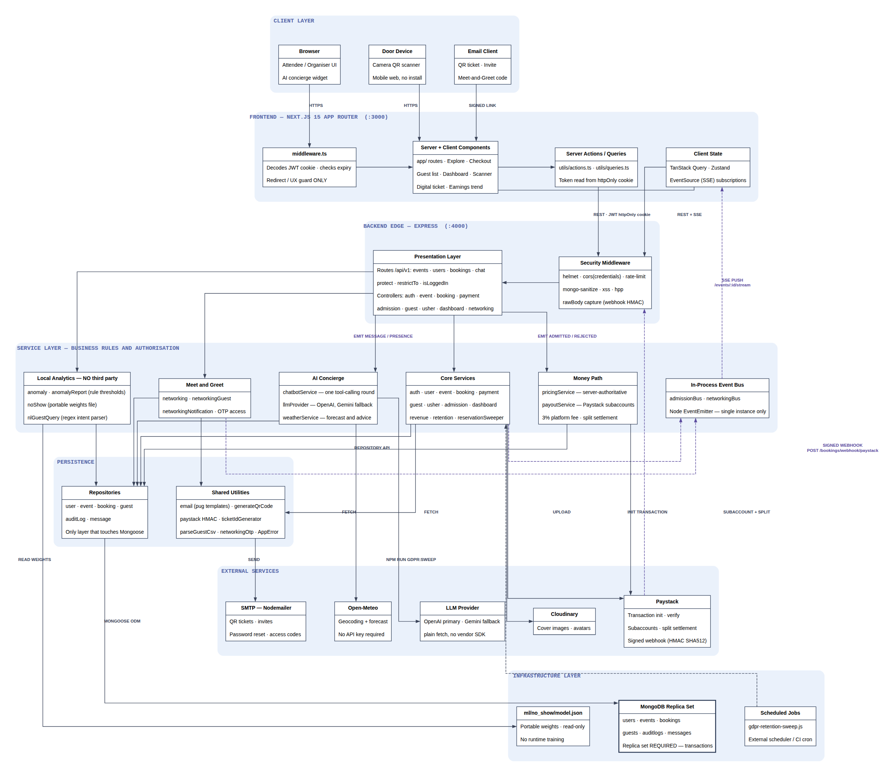
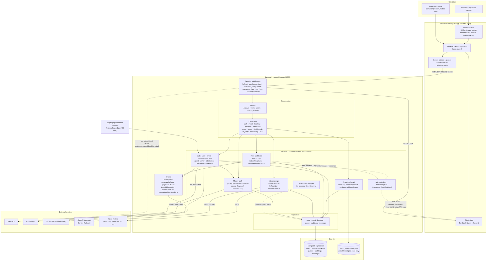
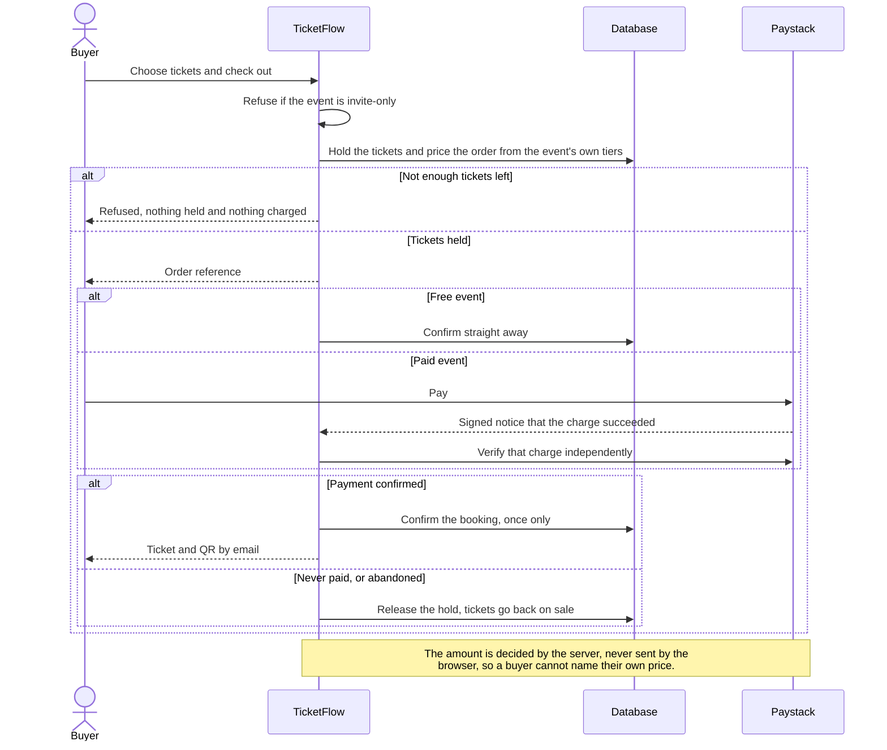
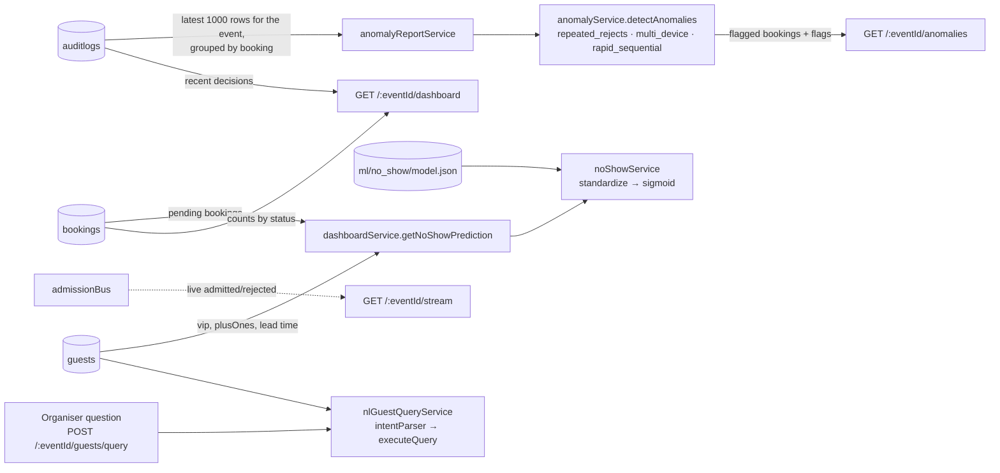
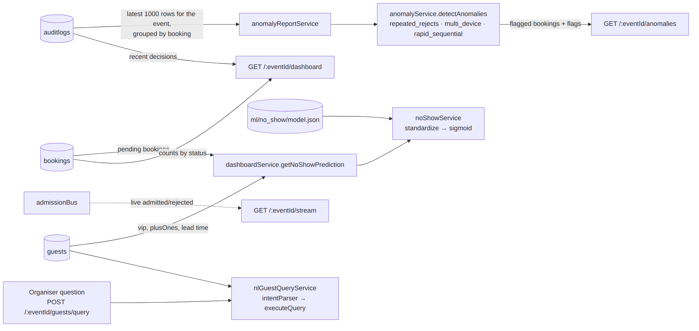

# TicketFlow - Architecture Diagram

> **Diagram set:** [Architecture](architecture-diagram.md) · [Use cases](use-case-diagram.md) · [Data flow](data-flow-diagram.md)
> All three describe the same system at different altitudes. Process numbers in the DFD
> (1.0–8.0) map to the service modules named here.

**Conventions.** Solid arrows are synchronous calls or request/response; dashed arrows are
asynchronous or inbound-from-outside (webhooks, server-sent events, in-process events).
Cylinders are persistent stores. Every claim below is traceable to a named module.

---

## 1. System / deployment architecture

*[Full-resolution SVG](diagrams/architecture.svg) · source: [`diagrams/src/architecture.dot`](diagrams/src/architecture.dot) · regenerate with `node docs/diagrams/render.mjs --dot`*

**Reading it.** Each pale band is a layer, labelled top-left. The rows inside a box name the
actual files or symbols it stands for, so every box can be checked against the source tree
rather than taken on trust. Solid arrows are synchronous calls; the purple dashed arrows are
the asynchronous and inbound paths - the Paystack webhook, the in-process event emitters and
the SSE push - which are the ones that surprise someone tracing a request by hand.

Mermaid source (same content, renders inline on GitHub)

*Rendered: [PNG](diagrams/mermaid/architecture-diagram-1.png) · [SVG](diagrams/mermaid/architecture-diagram-1.svg)*

**Note on the AI boundary.** Only the concierge chatbot (`BOT`) leaves the process for
inference. Everything else labelled AI here - anomaly detection, no-show prediction and
natural-language guest queries - runs locally: the first two on rule thresholds and a
portable weights file, and the NL guest query on a **regex intent parser, not a language
model**. The distinction matters both for the data-protection argument (guest lists are never
sent to a third party) and for accuracy in the report.

**Note on provider failure.** `llmProvider` calls OpenAI first and falls back to Gemini over
plain `fetch` with no vendor SDK, and with neither key configured the chatbot degrades to a
canned reply rather than erroring. An outage at either provider therefore removes a feature;
it never takes down a request path that sells or admits a ticket.

**Note on the frontend guard.** `middleware.ts` decodes the JWT client-side and treats any
unexpired token as authenticated - it does not verify the signature or read the role. It is a
redirect/UX convenience only. Every real authorisation decision is server-side
(`authController.protect`, `restrictTo`, and the ownership rules inside the services).

## 2. Layering and the dependency rule

> **Diagram:** see the package diagram in
> [`design-models.md` §4](design-models.md), which draws the same layering in more detail.
> It is kept in one place so the two cannot drift apart.

Dependencies point one way. Controllers never touch models directly; services never touch
`req`/`res`. Authorisation lives in the service layer - `canViewDashboard` is reused by the
dashboard, the guest list, the NL query, and erasure, so the same ownership rule holds on
every route that reaches them.

**Preconditions live there too, and for the same reason.** Whether an event *has* a guest
list at all is a property of the event, not of the caller: `hasGuestList(event)` is defined
once in `eventModel.js` and read both by `guestService`'s authorisation check and by
`eventService.getEventWorkspace`, the lookup the frontend calls to decide whether to draw the
Guest list tab. Putting the predicate in one place is what stops the browser and the API
disagreeing - they previously carried separate copies written in opposite directions, which
returned different answers for an event with no `accessMode`. The frontend is free to hide a
control, but it is never the thing that decides.

## 3. Booking status state machine

> **Diagram:** see [`design-models.md` §1.1](design-models.md), which models the same
> `Booking.status` machine alongside the payment lifecycle it interacts with.

The admission model is a six-state machine on `Booking.status`, not a boolean. `isCheckedIn`
is a derived virtual (`status === 'admitted'`), so there is one source of truth. The guard on
the transition into `admitted` is what makes a second scan fail rather than silently succeed.

## 4. Door check-in, the integrity-critical path

> **Diagram:** see the admission sequence in [`design-models.md` §2](design-models.md), which
> shows the same flow with the transaction boundary drawn explicitly.

**replica set** - `withTransaction` throws on a standalone
`mongod`.

## 5. Purchase and payment

The flow is **reserve → pay → confirm**. Seats are held before the buyer reaches Paystack,
so a charge always has a booking behind it.

<!-- Rendered image. Regenerate with: node docs/diagrams/render.mjs -->

*[Full-resolution SVG](diagrams/mermaid/architecture-diagram-2.svg)*

Three details that are easy to get wrong when reading this quickly:

- **Overselling is prevented by the guarded `$inc`, not by the transaction.**
  `reserveTicketInventory` matches `ticketQuantity: { $gte: count }` and decrements in one
  atomic operation; the transaction's job is all-or-nothing across *multiple tiers*.
- **Confirmation is idempotent and runs from two directions.** The webhook and the browser
  callback both land on `confirmReservation`; `confirmByReference` is guarded on
  `transactionStatus: 'pending'`, so exactly one call transitions the bookings and only that
  call sends email. Paystack's retries are therefore harmless.
- **The browser is never believed.** The callback supplies only a reference;
  `paymentService.confirmCheckout` verifies the charge against Paystack's API before
  confirming anything. It exists because a webhook can be delayed or misconfigured, and
  without it a paid reservation would be swept away 15 minutes later.

Every reservation has exactly one terminal outcome - confirmed, failed, or expired - and
each of them leaves inventory correct. `scripts/release-expired-reservations.js`
(`npm run reservations:release`) sweeps holds nobody resolved.

## 6. Analytics and live reporting

<!-- Rendered image. Regenerate with: node docs/diagrams/render.mjs -->

*[Full-resolution SVG](diagrams/mermaid/architecture-diagram-3.svg)*

`anomalyService` is rule-based and pure - no training step, unit-testable, and evaluated
against a committed labelled fixture (`scripts/eval-anomaly.js`: precision 0.948, recall
0.821, F1 0.880). `noShowService` reimplements scikit-learn inference in JS from exported
weights, so the running app needs no Python; `tests/unit/noShow.test.js` is a parity test
against `predict_proba`.
