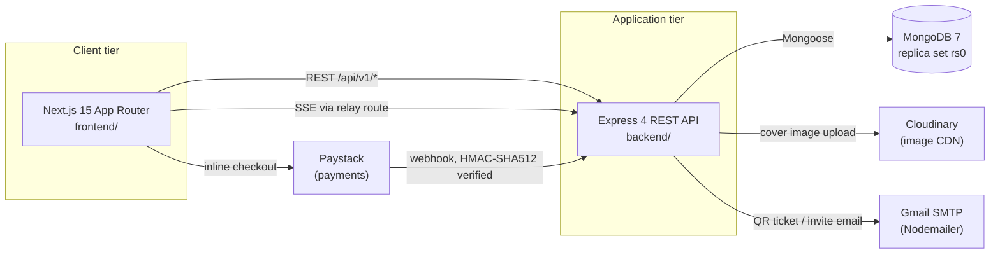
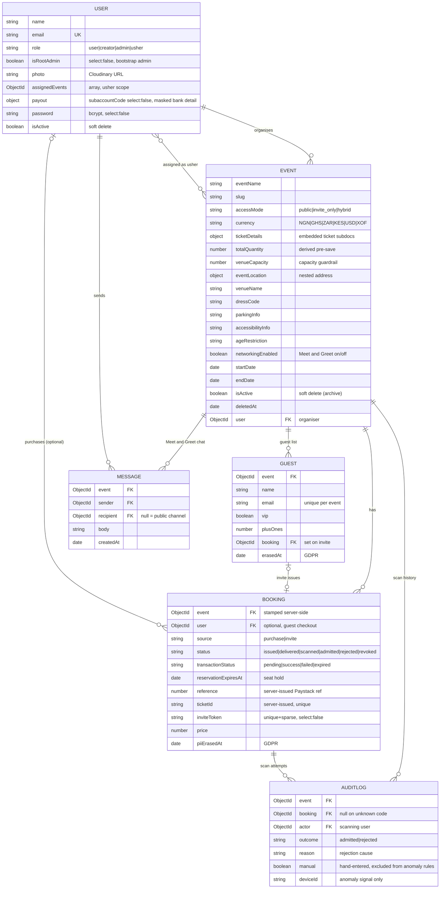
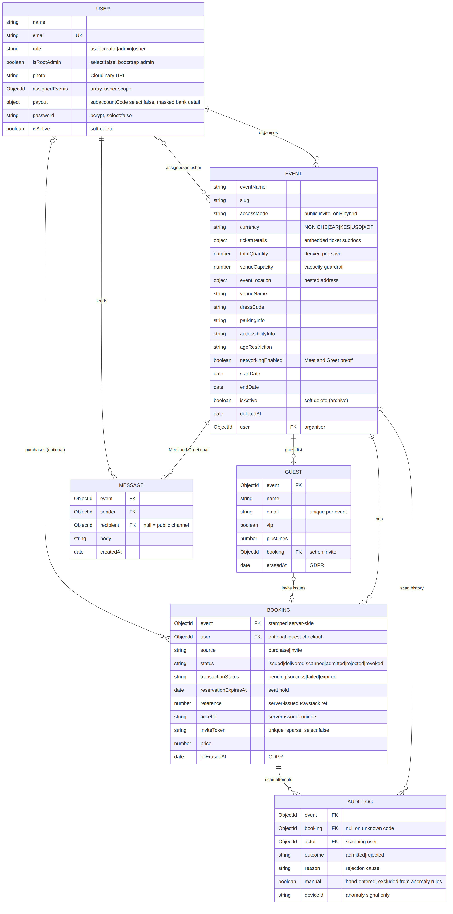

# TicketFlow - Technical Documentation

**Document version:** 4.3 · **Repository state:** branch `dev`, working tree ahead of commit `1ff7d82` · **Last verified:** 10 August 2026

> **Changes since v3.0.** Eleven areas changed materially:
>
> 1. **Administration** - signup can no longer grant `admin` (a privilege-escalation hole, OWASP A01, now closed by a role whitelist); a **root admin** is seeded from the CLI and is the only account that can promote or demote other admins; admins can change roles and **archive events and deactivate users** (soft delete, §5.7).
> 2. **Meet and Greet** (formerly "networking") - the attendee network is now reachable by **guests without accounts**, authorised by an emailed one-time code proving control of the booking email (§5.8). The public channel is now labelled **Event Chat (Public)**.
> 3. **AI concierge** - the chatbot gained a weather/dress-code/safety tool backed by **Open-Meteo** (§5.9) and can answer questions about a named event from local data.
> 4. **Richer events** - `venueName`, `dressCode`, `parkingInfo`, `accessibilityInfo`, `ageRestriction`, `venueCapacity`, `networkingEnabled`, plus soft-delete fields (§4).
> 5. **Quality engineering** - coverage is now measured (§8.7), a load-test harness exists with recorded figures, backend lint is enforced in CI, and the rate limit became configurable.
> 6. **Liveness fix** - an event whose `startDate` equals its `endDate` was never `live`; the window now runs to end-of-day.
> 7. **Revenue model** - TicketFlow now takes a **3% platform fee** via Paystack split payments, settling organisers directly to their own subaccount (§5.6.1). This required making ticket pricing **server-authoritative**, closing a defect that let a buyer name their own price.
> 8. **Revenue reporting** - organisers see gross/fee/net per event and in total; admins see the same across the whole platform, including the platform's own fee income (§5.6.2). Closes limitation 9b.
> 9. **Two door-scan defects fixed** - the scan query never loaded the capacity fields, so the venue-capacity guardrail silently never fired on a single real scan; and a correctly-typed code in the wrong case, or a legacy `#`-prefixed ID typed without the hash, was reported as an invalid ticket (§7.4.4).
>
> 10. **Guest list is scoped to the events that have one** - the shared organiser tab strip offered a Guest list for every event, including public ones, where the link could only produce a 400. The rule now has a single definition, `hasGuestList(event)`, computed server-side and returned by a new `GET /events/:eventId/workspace` lookup (§6.2). It previously existed twice, written in opposite directions, which disagreed whenever `accessMode` was absent.
> 11. **Diagrams are rendered to images** - every mermaid block in this document set now has a committed PNG and SVG beside it, and the use case and architecture diagrams are hand-authored Graphviz laid out for a printed page (`docs/diagrams/`). A fenced mermaid block does not render in a PDF or Word export, which is how this work is submitted.
>
> Limitations 1 and 6 of v3.0 are closed; the remaining items still stand (§12).

> **Purpose.** This document is supporting technical evidence for **7003SCN Advanced Software Development, Task 1.2** (design, implementation and testing evidence). Every claim below was verified by reading the source at the cited path - file paths are given so that screenshots for the Word submission can be taken directly from the repository and annotated.
>
> **Scope boundary.** This document covers only what is derivable from the codebase. Task 1.1 (agile process evidence, team member contributions), Tasks 2.1/2.2 (individual leadership and entrepreneurship evaluations) and Task 3 (peer assessment) require your team's own process artefacts and personal critical reflection, and are deliberately **not** covered here. See §13 for the coverage map.

---

## Contents

1. [Product overview](#1-product-overview)
2. [Technology stack](#2-technology-stack)
3. [Architecture](#3-architecture)
4. [Data model](#4-data-model)
5. [Feature implementation map](#5-feature-implementation-map)
6. [API reference](#6-api-reference)
7. [Authentication and security](#7-authentication-and-security)
8. [Testing strategy](#8-testing-strategy)
9. [Build, CI and deployment](#9-build-ci-and-deployment)
10. [User interface and design system](#10-user-interface-and-design-system)
11. [Development history as iterative-delivery evidence](#11-development-history-as-iterative-delivery-evidence)
12. [Known limitations and recommended improvements](#12-known-limitations-and-recommended-improvements)
13. [Mapping to assignment marking criteria](#13-mapping-to-assignment-marking-criteria)

---

## 1. Product overview

**TicketFlow** is a full-stack event-ticketing platform with integrated invite-only and hybrid guest management. A single data model serves three distinct real-world scenarios:

| Scenario | Access mode | How guests are admitted |
|---|---|---|
| Public ticketed event | `public` | Anyone browses and buys a ticket (Paystack); QR issued on purchase |
| Invite-only event | `invite_only` | Organiser uploads a guest list; each guest receives a single-use QR invite; purchase is refused |
| Hybrid event | `hybrid` | Both paid tickets and a curated guest list coexist on one event |

Beyond the core sell-and-admit loop, the system adds a door scanner with an atomicity guarantee, a real-time arrivals dashboard, a **Meet and Greet** attendee network, and four AI features: an LLM-backed concierge chatbot, scan-anomaly detection, natural-language guest queries, and no-show prediction.

### 1.1 User roles

Defined by the `role` enum in `backend/src/models/userModel.js` and enforced by `authController.restrictTo` plus the pure decision functions in `userService.js`:

| Role | Persona | Key capabilities |
|---|---|---|
| `user` *(default)* | Attendee | Browse events, purchase tickets, view "My Tickets", join Meet and Greet for events they hold a booking for |
| `creator` | Event organiser | Create/edit own events, manage guest list, assign ushers, view live dashboard |
| `usher` | Door staff | Scan and admit - **scoped to events listed in `User.assignedEvents` only** |
| `admin` | Platform administrator | All events and users; change roles; archive events; deactivate users |
| *root admin* | Bootstrap administrator | An `admin` additionally flagged `isRootAdmin`; the only account that may promote or demote other admins, and it cannot be demoted or deleted through the API |

**Role acquisition is deliberately constrained.** `userService.SIGNUP_ROLES` whitelists signup to `user` and `creator` only, so a crafted `role: "admin"` in a signup body is discarded rather than honoured. `admin` and `usher` are therefore only ever *granted*: `admin` by the root admin (or by `scripts/seed-admin.js` for the first one), `usher` implicitly by being assigned to an event's door staff.

---

## 2. Technology stack

Versions are taken from `backend/package.json` and `frontend/package.json`.

### 2.1 Frontend

| Concern | Choice |
|---|---|
| Framework | Next.js `^15.3` (App Router), React `^18.3`, TypeScript `^5` |
| Styling | Tailwind CSS `^4` with custom `@theme` tokens; Ant Design `^6.5`; `react-select` |
| Server state | TanStack Query `^5.101`; Axios `^1.19` as HTTP client |
| Client auth | `jwt-decode` + `cookies-next`, gated in Next.js Edge middleware |
| Payments | `react-paystack` `^4.0` |
| QR / export | `react-qr-code`, `react-barcode`, `react-to-pdf`, `html-to-image` |
| Guest import | `xlsx` (CSV and `.xlsx` parsing) |
| Testing | Vitest `^2.1` + React Testing Library (component); Playwright `^1.62` (end-to-end) |

### 2.2 Backend

| Concern | Choice |
|---|---|
| Runtime | Node.js `>=20` (`engines`), ES Modules; CI runs Node 22 |
| Framework | Express `^4.22` |
| Database | MongoDB 7 via Mongoose `^8.24` - **must run as a replica set** (see §3.5) |
| Authentication | `jsonwebtoken` `^9` + `bcrypt` `^6`, HTTP-only cookies |
| Hardening | `helmet`, `express-mongo-sanitize`, `express-xss-sanitizer`, `hpp`, `express-rate-limit`, `cors` |
| Payments | Paystack - **no SDK**; webhook verified by hand-rolled HMAC-SHA512 (`shared/utils/paystack.js`) |
| Media | Cloudinary `^2.10` (event cover images) |
| Email | Nodemailer `^9`; **Pug** templates for account email, **inline HTML strings** for ticket/invite email (see §5.4) |
| QR generation | `qrcode` `^1.5` (server-side, emitted as base64 data URLs) |
| ML | Logistic model trained offline in Python; coefficients loaded from `ml/no_show/model.json` |
| Testing | Node's built-in runner (`node --test`) - no third-party test framework |

> **Correction note (v2.0):** earlier drafts described email templating as "Nodemailer + Pug" without qualification. In fact only account emails (`welcome`, `passwordReset`) use Pug via `shared/utils/email.js`; the digital ticket (`shared/utils/document.js`) and guest invite (`shared/utils/sendInvite.js`) are built as inline HTML template literals.

---

## 3. Architecture

### 3.1 System context

Two independently deployable applications share one MongoDB database, orchestrated by `docker-compose.yml`:



<!-- Rendered image. Regenerate with: node docs/diagrams/render.mjs -->


*[Full-resolution SVG](diagrams/mermaid/technical-documentation-1.svg)*


### 3.2 Backend layering

The backend implements a **Controller → Service → Repository → Model** separation. Controllers hold no business logic; services are framework-agnostic (no `req`/`res`), which is what makes the pure-function authorisation tests in §8 possible.

```
backend/
├── app.js                      # Express wiring: middleware chain, routers, error handler
├── server.js                   # Process entrypoint, DB connection
├── src/
│   ├── models/                 # 5 Mongoose schemas
│   ├── presentation/
│   │   ├── controllers/        # 10 thin HTTP handlers
│   │   └── routes/             # 3 Express routers (user, event, booking)
│   ├── services/               # 14 service modules + nlQuery/ submodule
│   ├── repositories/           # 5 data-access modules wrapping Mongoose
│   └── shared/
│       ├── errors/             # AppError + global error handler
│       ├── events/             # admissionEvents.js - in-process pub/sub for SSE
│       ├── middleware/         # catchAsync, uploadImage
│       └── utils/              # email, QR, HTML ticket, Paystack HMAC, invite tokens
├── ml/no_show/                 # train.py, model.json, eval_report.txt
├── scripts/                    # migrations, GDPR sweep, ML/NL evaluation harnesses
└── tests/{unit,integration,fixtures,helpers}/
```

**Layer boundary example.** `bookingController.createBooking` performs only request unpacking and delegates to `bookingService.createBooking`, which orchestrates `eventRepository.reserveTicketInventory` and `bookingRepository.insertMany` inside a transaction. No Mongoose model is imported above the repository layer.

### 3.3 Real-time updates

The live arrivals dashboard uses **Server-Sent Events**, not polling or WebSockets. `GET /api/v1/events/:eventId/stream` (`dashboardController.streamEvent`) subscribes to an in-process `EventEmitter` in `shared/events/admissionEvents.js`, which `admissionService` publishes to on every successful admission. The frontend consumes this through a Next.js Route Handler relay at `frontend/src/app/api/events/[eventId]/stream/route.ts`.

*Design rationale:* admissions are a one-way server→client push with modest fan-out (door staff plus one organiser), so SSE delivers the requirement over plain HTTP without introducing a WebSocket server or an external broker such as Redis.

### 3.4 Frontend structure

App Router route groups organise pages by domain without affecting URLs:

```
frontend/src/app/
├── (authentication)/   login · signup · forgot-password · reset-password
├── (events)/           create-event · edit-event · dashboard · event-team ·
│                       explore-events · guest-list · my-events · scan
├── (legal)/            data-and-privacy · refund-policy · terms-and-conditions
├── (overview)/         landing page (page.tsx + loading.tsx)
├── my-profile/         tickets · event-history · event-sales · settings · help-and-support
├── checkout/ · about-us/ · contact-us/
└── api/events/[eventId]/stream/route.ts    # SSE relay
```

**Two-layer route protection.** `frontend/src/middleware.ts` decodes the JWT cookie at the edge and redirects unauthenticated users away from `protectedRoutes`, and authenticated users away from login pages. This decodes but does **not** verify the signature - it is a user-experience convenience only. The authoritative security boundary is server-side `protect` / `restrictTo` in Express (§7).

### 3.5 Why a replica set is mandatory

Ticket reservation (`eventRepository.reserveTicketInventory`) and door admission (`admissionService.checkInByScan`) use **multi-document transactions**, which MongoDB only supports on a replica set - a standalone `mongod` throws at `startSession().withTransaction()`. Both `docker-compose.yml` and the CI workflow therefore initialise a single-node replica set (`rs0`) rather than a plain instance. Integration tests detect the absence of a replica set and skip gracefully (`tests/helpers/db.js`).

---

## 4. Data model

Six collections. The central modelling decision is to unify ticketed and invite-only events under **one** `Event` type discriminated by `accessMode`, rather than maintaining two parallel event systems.



<!-- Rendered image. Regenerate with: node docs/diagrams/render.mjs -->


*[Full-resolution SVG](diagrams/mermaid/technical-documentation-2.svg)*


### 4.1 Design decisions worth citing as evidence

| Decision | Implementation | Rationale |
|---|---|---|
| **`accessMode` unification** | `Event.accessMode` enum; sales-date fields use *function-valued* `required` validators so they apply only when `accessMode !== 'invite_only'` | One schema serves three business scenarios; avoids duplicating the entire event/booking surface |
| **`Booking.status` state machine** | `issued → delivered → scanned → admitted`, with `rejected`/`revoked` as terminal states; a virtual `isCheckedIn` preserves the old boolean contract | Replaced a boolean `isCheckedIn` flag; enables richer reporting and makes double-admission detectable |
| **Conditional purchase fields** | `requiredForPurchase` validator array (`bookingModel.js:6–11`) gates `currency`, `ticketId`, `reference` etc. on `source === 'purchase'` | Invite bookings have no checkout, so payment fields must not be mandatory |
| **`Guest` as its own collection** | Not embedded in `Event`; unique compound index `{event, email}` | Guest lists can be large; embedding would bloat the event document and prevent per-guest indexing |
| **`AuditLog` append-only** | One document per scan attempt, success *or* rejection; `manual: true` marks hand-entered admissions | A status flag records only the final state; the log preserves every attempt. Manual entries are excluded from anomaly detection - they carry no device fingerprint or scan timing, so including them would manufacture false `rapid_sequential` flags |
| **Two independent status axes** | `status` tracks *admission* (`issued…admitted`); `transactionStatus` tracks *payment* (`pending…success`) | A ticket can be paid but not yet admitted, or admitted on a free event that was never charged. Collapsing both into one field would make those states unrepresentable |
| **Server-issued identifiers** | `reference`, `ticketId` and `event` are all stamped in `reserveBooking` **after** the client payload is spread, so a supplied value is discarded | `ticketId` is the code the door scanner admits on, and `reference` binds a charge to a reservation. Accepting either from the client lets a caller choose its own admission code or attach to someone else's charge |

---

## 5. Feature implementation map

### 5.1 Feature-to-source index

| Feature | Primary source |
|---|---|
| Signup / login / logout / password reset | `presentation/controllers/authController.js`, `services/authService.js` |
| Profile update, soft-delete account | `userController.js`, `services/userService.js` |
| Event discovery (list, count, trending, upcoming, detail) | `eventRoutes.js:13–17`, `services/eventService.js` |
| Event creation & editing with image upload | `eventController.js`, `shared/middleware/uploadImage.js` (Cloudinary) |
| Seat reservation & checkout | `bookingService.reserveBooking`, `frontend/src/hooks/usePaystack.tsx` |
| Payment confirmation (server-authoritative) | `bookingService.confirmReservation`, `paymentService.confirmCheckout`, `shared/utils/paystack.js` |
| Reservation release & expiry sweep | `bookingService.releaseReservation`, `releaseExpiredReservations`, `scripts/release-expired-reservations.js` |
| **Ticket ID issuance** | `shared/utils/ticketIdGenerator.js` (server-side, crypto-random, unique-indexed) |
| **QR ticket generation & email** | `shared/utils/generateQrCode.js`, `shared/utils/document.js`, `shared/utils/generatePdf.js` |
| Guest-list import (CSV / XLSX) | `guestController.importGuests`, `shared/utils/parseGuestCsv.js` |
| Invite issuance (single-use QR) | `shared/utils/inviteToken.js`, `shared/utils/sendInvite.js`, `services/guestService.js` |
| **Atomic door scan-and-admit** | `services/admissionService.js` - `checkInByScan`, `authorizeScan` |
| Usher assignment | `usherController.js`, `services/usherService.js` |
| Live arrivals dashboard (SSE) | `dashboardController.js`, `services/dashboardService.js` |
| Scan anomaly detection | `services/anomalyService.js`, `services/anomalyReportService.js` |
| Natural-language guest queries | `services/nlQuery/intentParser.js`, `services/nlQuery/executeQuery.js` |
| No-show prediction | `ml/no_show/train.py` (offline), `services/noShowService.js` (runtime) |
| GDPR erasure & retention sweep | `services/retentionService.js`, `scripts/gdpr-retention-sweep.js` |
| **AI concierge chatbot (LLM)** | `services/chatbot/chatbotService.js`, `services/chatbot/llmProvider.js`, `chatRoutes.js` |
| **Weather / dress-code / safety advice** | `services/weatherService.js` (Open-Meteo geocoding + forecast) |
| **Meet and Greet** - public channel & DMs | `services/networkingService.js`, `networkingController.js`, `models/messageModel.js` |
| **Guest access to Meet and Greet by email OTP** | `services/networkingGuestService.js`, `shared/utils/networkingOtp.js`, `shared/utils/sendNetworkingOtp.js` |
| **Signup role whitelist** | `services/authService.js` - `SIGNUP_ROLES` (`['user', 'creator']`, frozen) |
| **Role management (root-admin guarded)** | `services/userService.js` - `canChangeRole`, `changeUserRole` |
| **Admin soft delete (users / events)** | `userService.canDeleteUser`/`deleteUser`, `eventService.deleteEvent` |
| **Admin bootstrap** | `scripts/seed-admin.js` (sets `role: 'admin'` + `isRootAdmin`) |
| **Platform fee / split payments** | `services/pricingService.js` - `platformFeeMinor`, `buildSplit` |
| **Revenue reporting (organiser + platform)** | `services/revenueService.js`, `GET /events/revenue/summary` |
| **Supported currencies** | `services/pricingService.js` - `SUPPORTED_CURRENCIES`, enforced by the `Event.currency` enum |
| **Daily earnings trend chart** | `revenueService.dailySeries`, `frontend/src/components/ui/earnings-trend.tsx` |
| **Digital ticket (web), matching the emailed one** | `frontend/src/components/ui/digital-ticket.tsx`, `shared/utils/document.js` |
| **Server-authoritative pricing** | `services/pricingService.js` - `priceBuyers`, `findTier` |
| **Organiser payout onboarding** | `services/payoutService.js`, `frontend/src/app/my-profile/payouts/` |
| Venue capacity guardrail | `services/admissionService.js` - `capacityDecision` |
| Reservation expiry sweeper (in-process) | `shared/reservationSweeper.js` |

### 5.2 Checkout lifecycle - reserve, pay, confirm

Checkout is a three-phase flow. The ordering is the design point: seats are held **before** the buyer reaches Paystack, so a charge can never exist without a booking behind it.

> **Diagram:** see the purchase sequence in [`architecture-diagram.md` §5](architecture-diagram.md). It is drawn once, there, so the two documents cannot describe different flows.

**Why it was restructured.** The earlier flow charged the buyer first and only then asked the API to create the booking. A closed tab, a dropped connection, or a tier selling out between payment and callback left a buyer charged with no ticket; and because inventory was decremented only after payment, two buyers could both pay for the last seat.

**Failure handling.** An abandoned or failed charge is released by `releaseReservation`, and any hold older than `RESERVATION_TTL_MS` (15 minutes) is swept by `releaseExpiredReservations` (`npm run reservations:release`). Both are guarded on the `pending` state, so a webhook retry racing the sweep cannot credit the same seats twice. Released bookings are marked `revoked` rather than deleted, keeping abandoned checkouts auditable.

**Idempotency.** Both the client's confirm call and Paystack's (retried) webhook land in `confirmReservation`. A guarded update means exactly one call transitions the bookings and sends email; the rest are no-ops that still report success.

### 5.3 Ticket ID issuance

`ticketId` is not merely a display reference - `bookingRepository.findByInviteTokenOrTicketId` resolves a scanned QR against `inviteToken` **or** `ticketId`, so it is the bearer credential that admits its holder. It is therefore issued by `shared/utils/ticketIdGenerator.js` inside `reserveBooking`, positioned after the client payload is spread so any supplied value is discarded.

| Property | Implementation |
|---|---|
| Source of randomness | `crypto.randomBytes` - not `Math.random`, which is seeded and predictable |
| Alphabet | Crockford base32 minus `I`, `L`, `O`, `U`, so a code cannot be misread off a printout |
| Entropy | 32¹² ≈ 2⁶⁰, comparable to the invite token |
| Uniform distribution | 256 is an exact multiple of 32, so the byte modulo is unbiased |
| Uniqueness | Unique index on `Booking.ticketId`, with `partialFilterExpression: { ticketId: { $type: 'string' } }` |

**Why a partial and not a sparse index.** A sparse unique index still indexes a document that sets the field to an explicit `null`, so a second invite booking written that way would collide. The partial filter indexes only documents where `ticketId` is a string, leaving invite bookings - which carry none - entirely out of the index.

Existing data is reconciled by `scripts/migrate-ticket-ids.js` (`npm run migrate:ticket-ids`), which re-issues IDs that are missing or duplicated, keeping the oldest of each duplicate group so the longest-circulating ticket retains the code its holder already has.

### 5.4 QR code generation - end-to-end

Both admission paths converge on `shared/utils/generateQrCode.js`, which returns a base64 PNG **data URL** (`QRCode.toDataURL`, error-correction level `H`). Embedding inline avoids needing an asset host or email attachment.

```
Purchase path                                Invite path
─────────────                                ───────────
bookingService.confirmReservation            guestService.issueInvite
  └─ charge verified                           └─ generateInviteToken()
  └─ generateQRCode(booking.ticketId)          └─ sendInvite()
  └─ sendPdf({ ...event, ...booking, qr })          └─ generateQRCode(inviteToken)
       └─ pdfTemplate() → HTML          └─ HTML 
       └─ Nodemailer → buyer                        └─ Nodemailer → guest
```

Tickets are emitted from `confirmReservation`, not from `reserveBooking` - an unpaid hold must never produce a scannable ticket. Delivery failure is caught and logged rather than thrown: a bounced email must not undo a confirmed payment, and the QR remains available from the buyer's account.

At the door, one `$or` lookup resolves **either** code, so a single scanner endpoint handles both guest types.

> **Defects fixed in this revision.** (1) The purchase path never called `generateQrCode.js` - only the invite path did - and `document.js` contained no `` element, so purchased-ticket emails shipped with no QR at all. (2) `frontend/src/components/ui/digital-ticket.tsx` encoded the buyer's *name* rather than the `ticketId`, producing a QR with no scannable identifier. (3) `ticketId` was generated in the browser as a 7-character uuid slice with no uniqueness constraint, letting a caller choose its own admission code. All three are corrected; the unique index has been built and verified to reject duplicates with `E11000`.

### 5.5 Venue capacity guardrail

Occupancy limits are a fire-safety obligation, so the door enforces them rather than trusting ticket inventory - organisers routinely oversell against expected no-shows, which makes `totalQuantity` the wrong number to stop on once a real venue capacity is known.

| Element | Behaviour |
|---|---|
| `Event.venueCapacity` | Optional. Safe physical occupancy, distinct from tickets sold |
| Precedence | `venueCapacity` → `totalQuantity` → unlimited. An invite-only event carries no ticket inventory, so a missing figure means *no limit*, never *no entry* |
| `admissionService.capacityDecision` | Pure function returning `{ allow, reason }`; unit-tested in `tests/unit/capacity.test.js` |
| Enforcement point | The admitted count is read **inside** the admission transaction, so two scanners at capacity − 1 cannot both admit |
| Override | `POST /bookings/scan { overrideCapacity: true }`, re-sent deliberately after a 409 - not a sticky mode |
| Accountability | An override is recorded on the audit row as `reason: 'capacity_override'`, so exceeding capacity names who authorised it |
| Dashboard | Snapshot exposes `remaining`, `atCapacity` and `capacitySource` so the organiser sees it coming rather than learning from a queue outside |

The design point worth citing: this is a **stop-and-confirm, not a hard block**. Refusing outright would strand a paying guest at the door with no recourse; admitting silently would defeat the safety purpose. Requiring an explicit, logged decision keeps a human accountable for the trade-off.

### 5.6 Naming caveat

`shared/utils/generatePdf.js` and its `pdfTemplate` helper are **misnomers**: they render an HTML email body, not a PDF. No PDF is produced server-side. PDF export is a client-side concern handled by `react-to-pdf` in the browser.

### 5.6.1 Revenue model - server-authoritative pricing and the platform fee

TicketFlow takes a **3% platform fee** on each paid ticket, implemented as a Paystack **split payment** so the organiser is settled directly by the payment provider and the platform never holds their money.

**Money flow.** The buyer is charged the advertised ticket price. Paystack routes the organiser's share to their own subaccount and the platform's `transaction_charge` to the main account, in the same transaction. `bearer: 'subaccount'` places Paystack's own processing fee on the organiser, so the platform's margin is exactly the stated 3% and does not shrink - or go negative on a cheap ticket - as gateway pricing changes.

| Concern | Where | Decision |
|---|---|---|
| Fee rate | `pricingService.PLATFORM_FEE_PERCENT` | 3%, configurable via env so commercial terms are a deployment decision, not a code change |
| Fee amount | `platformFeeMinor` | Computed in minor units and **rounded down** |
| Split parameters | `buildSplit` | `subaccount` + explicit `transaction_charge` + `bearer: 'subaccount'` |
| Onboarding | `payoutService`, `/users/me/payout` | Bank picker → account resolution → subaccount creation |
| Stored | `User.payout` | Subaccount code (`select: false`), bank, **last four digits only** |

Four decisions are worth defending in the report:

1. **Pricing had to become server-authoritative first.** `reserveBooking` previously spread the client's buyer objects straight into the booking, so `price` was whatever the browser claimed; the Paystack popup was opened with a browser-computed `amount`; and `verifyTransaction` checked only that a charge *succeeded*, never its value. A buyer could pay ₦1 for a ₦50,000 ticket and receive a valid, scannable ticket. **A percentage of a number the payer chooses is not a fee**, so this was a prerequisite rather than a separate improvement. Price and currency now come from the event's own tiers, and confirmation compares the actual charge against the amount recomputed from the stored bookings.

2. **The fee rounds down, not up.** Rounding up would take a fraction more than the advertised rate on every transaction where it makes a difference, always in the platform's favour, and it is the organiser who would have to notice. When a rounding rule can only favour one party, it should favour the party who did not write it.

3. **`transaction_charge`, not the subaccount's `percentage_charge`.** Paystack subaccounts carry a stored `percentage_charge`, but the *direction* of that field - whether it names the platform's cut or the organiser's share - is ambiguous in the published documentation, and the documentation pages could not be retrieved to settle it. `transaction_charge` is unambiguous: an explicit amount to the main account that overrides the stored configuration. Sending it on **every** transaction means the ambiguous field never decides who gets paid, whatever it is set to. *Depending only on the contract you can verify is the design principle here*, and it is a better answer than guessing correctly would have been.

4. **An organiser with no payout account cannot sell paid tickets - checkout refuses with 409.** The alternative is charging the buyer and settling the entire amount into the platform account, invisibly to both parties: precisely the silent revenue retention this feature exists to remove. A refusal is recoverable in minutes through the payouts page; money landing in the wrong account is not.

**Data minimisation.** The full bank account number is never stored. Paystack holds it; TicketFlow keeps the opaque subaccount code, the bank, and the last four digits so the organiser can recognise which account they connected. Storing full account numbers would create a payment-data liability with no matching capability - nothing in this system can act on one. The subaccount code is `select: false` and never leaves the server.

**Onboarding is two-step by design**: enter the account, then confirm the **name it resolves to** before anything is saved. A mistyped digit would otherwise route an event's entire revenue to a stranger, and bank transfers are not reversible on request - the confirmation has to happen while the mistake is still free to make.

### 5.6.2 Revenue reporting

`GET /events/revenue/summary` (`revenueService.js`) answers two questions the product could not previously answer at all: *what has this event earned me, net of the platform fee*, and *what has the platform earned across every event*. Before it, the only financial figure anywhere was a per-event "Gross Sales" total on one page, with no concept of the fee and no aggregation - the codebase contained no `aggregate()` call at all.

**The two questions are kept apart, because they have different answers.** An admin is usually also an organiser, so a single merged figure would be wrong for both: `?scope=own` (the default) reports events the caller organises, `?scope=platform` reports the whole platform. The UI presents them as tabs.

| Scope | Audience | The headline figure |
|---|---|---|
| `own` | Anyone | **Net** — what the organiser is due after the fee |
| `platform` | **Admin only** | **The platform fee alone** — TicketFlow's income |

**Reporting gross or net as "platform revenue" would overstate it by more than an order of magnitude**, and the page previously led with those. Gross belongs to the organisers; net is what is paid away to them. Only the fee is the platform's, and on the platform tab it is the emphasised tile with gross and net demoted to context.

Five decisions worth citing:

1. **Scope is authorised inside the service, not on the route.** `platform` is refused with 403 for any non-admin and an unrecognised scope is a 400 rather than a silent default, so no other caller of the service can bypass the check either. Covered by tests asserting that one organiser cannot see another's takings.
2. **The fee is summed per transaction, not taken as a percentage of the grand total.** `platformFeeMinor` rounds down, so the two differ in general, and Paystack deducts per transaction. A report derived differently from the way the money actually moved produces a statement that never reconciles with the provider's.
3. **Only confirmed payments count.** Pending holds have not been paid and expired ones never will be; including either would report revenue that does not exist.
4. **Archived events are included.** Money an archived event took is still money the platform took, so dropping those rows would make the report impossible to reconcile.
5. **A daily series accompanies the totals**, dated by the booking's `createdAt` — there is no `paidAt` on a booking, and confirmation follows reservation within minutes, so it is the closest honest proxy. Days with no sales are **filled with zeroes rather than omitted**: a chart that skips empty days silently compresses time and makes a quiet week look like continuous trading. The series is drawn as **columns, not a line** — each value is a total accumulated within a day, and a line would interpolate between them, asserting a figure at an hour the data cannot answer for. A test asserts the series sums exactly to the totals shown above it, because a chart that disagrees with its own headline is worse than no chart.

**Two limits are stated in the UI rather than hidden.** "Net" is before Paystack's own processing charge - the organiser bears it (`bearer: 'subaccount'`) and TicketFlow never sees it, so reporting it would mean inventing a number. And these figures are what was *instructed and charged*, not what was confirmed *settled*; settlement reconciliation is limitation 9c.

### 5.6.3 What the buyer is charged

The advertised ticket price, with **no booking fee added at checkout** - the platform fee is deducted from the organiser's settlement, not added to the buyer's bill.

This had to be corrected. `calculateFinalPrice` in the frontend grossed the displayed total up by a hardcoded **5% + 100**, so a 5,000 ticket read as 5,380. It was a legacy fee model, and by the time it was found it was wrong twice over: the fee is 3% and comes from the other side of the transaction, and the amount charged is computed server-side from the event's tiers - so the inflated figure was not even what Paystack took. **The page was quoting a price nobody was charging.** The helper is deleted, and the checkout total now shows the plain sum with its currency.

If a buyer-visible booking fee is ever wanted, it must be added on the server where the charge is built, never re-derived in the browser.

### 5.6.4 Currency

Ticket prices are charged in one of the currencies the payment provider can settle:

| | |
|---|---|
| Supported | `NGN`, `GHS`, `ZAR`, `KES`, `USD`, `XOF` |
| Enforced by | `pricingService.SUPPORTED_CURRENCIES`, an `enum` on `Event.currency` |
| Chosen | explicitly by the organiser at creation and edit |

**This is a provider constraint, not a preference**, and it was previously violated silently. Currency was derived from the event's country - United Kingdom to GBP, Germany/France to EUR - and Paystack settles neither. Such an event was created happily, listed happily, and then rejected the charge *at the gateway, after the buyer had committed*. Restricting the field at the point of creation converts a payment-time failure into a form-time one.

Two supporting decisions: the field is `uppercase` so `ngn` and `NGN` are one currency, and changing the country on an existing event no longer overwrites its currency - doing so silently repriced a published event whenever an organiser corrected its location.

### 5.7 Administration - bootstrap, role change and soft delete

Administration is built around one constraint: **an administrator can never be self-granted.** Three mechanisms enforce it.

**Signup whitelist.** `authService` filters the submitted role through `SIGNUP_ROLES` (`['user', 'creator']`, frozen), so `role: "admin"` in a signup body is discarded. Previously the value was written straight to the document - a textbook mass-assignment privilege escalation (OWASP A01), verified as blocked after the fix by attempting it against a running server.

**Root admin.** `scripts/seed-admin.js` promotes a named, already-existing account and flags it `isRootAdmin`. The flag is `select: false`, so it is only loaded where a decision depends on it - which is itself a defect class worth noting: `userRepository.findByIdWithRole` had to explicitly `select('+isRootAdmin')`, because without it the root-demotion guard read `undefined` and would have silently never fired.

**Pure decision functions.** `canChangeRole(actor, target, role)` and `canDeleteUser(actor, target)` in `userService.js` are total functions over plain objects, so they are unit-testable without a database (`tests/unit/role.authz.test.js`). Between them they refuse: changing your own role, deleting yourself, a non-root admin granting or revoking `admin`, and demoting or deleting the root admin.

**Deletion is archival, never destructive.** Both `User` and `Event` carry `isActive` with a `pre(/^find/)` hook excluding inactive documents, so an "archived" event disappears from every listing without a single referencing row being removed. This mattered concretely: an audit of the live database before implementing it found 3 events with **paid** bookings, and 17 bookings, 13 guests, 4 audit rows, 20 chat messages and 24 usher assignments referencing events. A hard delete would have voided paid tickets and destroyed the admission audit trail - which is precisely the record a door dispute needs. Archiving an event does unassign its door staff, since a scan scope on a hidden event is meaningless.

### 5.8 Guest access to Meet and Greet, by emailed one-time code

Most attendees never create an account: a guest checkout or an emailed invite captures only a name and an email. Gating the attendee network on a login would therefore have excluded the majority of the people it exists to connect.

The authorisation question is *"do you control the email address on a booking for this event?"*, and the answer is proved by a one-time code rather than a password:

1. `POST /events/:eventId/network/guest/request` - if the address matches a valid booking, a 6-digit code is emailed. The response is deliberately identical either way, so the endpoint cannot be used to enumerate who holds tickets.
2. Only the **SHA-256 hash** of the code is stored, with a **10-minute** TTL.
3. `POST /events/:eventId/network/guest/verify` compares with `crypto.timingSafeEqual`, and on success mints an ordinary session - from that point the guest travels the same authorisation paths as any other attendee, so no parallel permission model exists to drift out of sync.

Both routes are registered ahead of `router.use(protect)`, and use two path segments so the public `/:slug` event route cannot swallow them.

### 5.9 Weather, dress-code and safety advice (Open-Meteo)

`services/weatherService.js` geocodes the event location and fetches a daily forecast from **Open-Meteo** (no API key, no account). `buildAdvice` turns the forecast plus the event's own `dressCode`, `venueName` and indoor/outdoor context into practical guidance, and the chatbot reaches it through the `get_event_conditions` tool.

Two design points are worth defending in the report:

- **Forecast horizon is honest.** `FORECAST_HORIZON_DAYS = 16` matches what the provider actually supports; beyond it the service says it cannot forecast rather than extrapolating. Confidently wrong weather advice for an event three months out is worse than none.
- **It does not pretend to assess crime risk.** The safety advice is general venue/arrival guidance and carries an explicit disclaimer that it is **not** a crime-risk assessment. An LLM inferring danger from a place name would produce exactly the sort of unevidenced, and likely discriminatory, claim about neighbourhoods that a system like this has no business making.

---

## 6. API reference

All routes are mounted under `/api/v1` (`backend/app.js:95–98`): `/events`, `/users`, `/bookings` and `/chat`. "Protected" means `authController.protect` (valid JWT required).

### 6.1 `/users` - `userRoutes.js`

| Method | Path | Access | Purpose |
|---|---|---|---|
| `POST` | `/signup` | Public | Register a new account |
| `POST` | `/login` | Public | Authenticate, set JWT cookie |
| `GET` | `/logout` | Public | Clear the JWT cookie |
| `POST` | `/forgot-password` | Public | Email a password-reset token |
| `PATCH` | `/reset-password/:token` | Public | Consume token, set new password |
| `GET` | `/get-my-account` | Optional auth | Current user, or `null` for guests |
| `GET` | `/me` | Protected | Own profile |
| `PATCH` | `/update-my-password` | Protected | Change password (re-issues JWT) |
| `PATCH` | `/update-my-details` | Protected | Update profile, optional photo upload |
| `DELETE` | `/delete-me` | Protected | Soft-delete (`isActive: false`) |
| `GET` | `/` | **Admin** | List all users |
| `GET` | `/:id` | **Admin** | Fetch any user |
| `GET` | `/me/payout` | Protected | The caller's own payout account (never the subaccount code) |
| `GET` | `/payout/banks` | Protected | Banks available for payout, from Paystack |
| `POST` | `/payout/resolve-account` | Protected | Resolve an account number to its registered name, before saving |
| `POST` | `/me/payout` | Protected | Create the Paystack subaccount and connect it |
| `PATCH` | `/:id/role` | **Admin** | Change a user's role - `canChangeRole` blocks self-changes, blocks non-root admins from granting or revoking `admin`, and blocks demoting the root admin |
| `DELETE` | `/:id` | **Admin** | Deactivate a user (`isActive: false`) - `canDeleteUser` blocks self-deletion and deletion of the root admin |

`POST /signup` accepts a `role`, but `authService` passes it through the `SIGNUP_ROLES` whitelist, so anything other than `user` or `creator` silently becomes `user`. Before this change the value was written straight to the document, which let anyone self-register as an administrator (OWASP A01: Broken Access Control).

### 6.2 `/events` - `eventRoutes.js`

| Method | Path | Access | Purpose |
|---|---|---|---|
| `GET` | `/` | Public | List and filter events |
| `GET` | `/count` | Public | Total event count |
| `GET` | `/trending` | Public | Trending events |
| `GET` | `/upcoming` | Public | Upcoming events |
| `GET` | `/:slug` | Public | Single event detail |
| `POST` | `/create` | Protected | Create event (multipart cover image) |
| `POST` | `/:eventId/network/guest/request` | **Public** | Email a one-time code to a guest holding a booking on this event |
| `POST` | `/:eventId/network/guest/verify` | **Public** | Exchange that code for an ordinary session |
| `GET` | `/my/events` | Protected | Events owned by the caller. `?scope=all` widens to every event **for an admin only** — ignored for anyone else |
| `GET` | `/my/assigned-events` | Protected | Events the caller works as door staff (empty list for everyone else) |
| `GET` | `/revenue/summary?scope=own\|platform` | Protected | Revenue per event plus totals - own events for an organiser, **all** events for an admin |
| `PATCH` | `/update/:eventId` | Protected † | Edit event |
| `DELETE` | `/:eventId` | **Admin** | Archive an event (`isActive: false`); bookings, guests, chat and audit rows are kept, assigned ushers are unassigned |
| `GET` | `/:eventId/workspace` | Protected ※ | Name, slug, access mode and `hasGuestList` for one event - what the organiser surfaces need to draw their own tab strip |
| `GET` | `/:eventId/dashboard` | Protected † | Live dashboard snapshot |
| `GET` | `/:eventId/stream` | Protected † | SSE admission stream |
| `GET` | `/:eventId/anomalies` | Protected † | Scan-anomaly report |
| `GET` | `/:eventId/guests` | Protected †◇ | List guest entries |
| `POST` | `/:eventId/guests` | Protected †◇ | Import guests, issue invites |
| `POST` | `/:eventId/guests/query` | Protected †◇ | Natural-language guest query |
| `DELETE` | `/:eventId/guests/:guestId/erase` | Protected †◇ | GDPR erase one guest |
| `GET` | `/:eventId/ushers` | Protected † | List assigned door staff |
| `POST` | `/:eventId/ushers` | Protected † | Assign an usher |
| `DELETE` | `/:eventId/ushers/:userId` | Protected † | Unassign an usher |
| `GET` | `/:eventId/network/stream` | Protected ‡ | SSE stream - Meet and Greet messages and presence |
| `GET` | `/:eventId/network/directory` | Protected ‡ | Opted-in attendees for this event |
| `PATCH` | `/:eventId/network/opt-in` | Protected ‡ | Join or leave the attendee directory |
| `POST` | `/:eventId/network/messages` | Protected ‡ | Post to **Event Chat (Public)** |
| `GET`/`POST` | `/:eventId/network/dms/:userId` | Protected ‡ | Read / send a direct message |

† No role gate at the router; **ownership is enforced in the service layer** (event creator or admin). This is a deliberate pattern - see §7.2.

◇ Additionally conditional on the **event**, not the caller: `guestService` rejects guest-list management with **400** unless `accessMode` is `invite_only` or `hybrid`. A public event has no guest list - everyone attending holds a ticket - so an organiser who owns one still cannot reach these routes. The single predicate behind that rule is `hasGuestList(event)` in `eventModel.js`.

※ Authorised with `admissionService.authorizeScan` rather than `canViewDashboard`: owner, admin, **or an usher assigned to the event**. The scanner is one of the four surfaces that calls it, and door staff must be able to open theirs.

‡ Eligibility is enforced in `networkingService`: the caller must hold a non-revoked, non-rejected booking for the event (or be its organiser/admin). Posting is additionally gated on the event being live. The two `network/guest/*` routes are registered **before** `router.use(protect)` and use two path segments so the public `/:slug` route cannot swallow them.

### 6.4 `/chat` - `chatRoutes.js`

| Method | Path | Access | Purpose |
|---|---|---|---|
| `POST` | `/` | Optional auth, separate rate limiter | AI concierge turn - event search, event Q&A, FAQ, weather/dress-code advice |

### 6.3 `/bookings` - `bookingRoutes.js`

| Method | Path | Access | Purpose |
|---|---|---|---|
| `POST` | `/webhook/paystack` | Paystack HMAC | Server-authoritative payment confirmation |
| `POST` | `/create` | Optional auth | **Reserve** seats, issue reference + ticket IDs; supports guest checkout |
| `POST` | `/confirm` | Optional auth | Confirm a reservation after checkout; verifies the charge with Paystack before issuing tickets |
| `GET` | `/my-tickets` | Protected | Caller's bookings |
| `GET` | `/event/:event` | Protected | Bookings for an event (organiser view) |
| `PATCH` | `/check-in/:id` | Protected | Manual check-in (ownership checked in service) |
| `POST` | `/scan` | `usher` \| `creator` \| `admin` | Atomic scan-and-admit |

---

## 7. Authentication and security

### 7.1 Authentication

- **Stateless JWT** issued by `authController.createSendToken`, delivered in an **HTTP-only cookie** and also accepted as an `Authorization: Bearer` header.
- **Password storage:** bcrypt with cost factor **14** (`userModel.js:90`), well above the common default of 10.
- **Token invalidation on password change:** `passwordChangedAt` is compared against the token's `iat` in `changedPasswordAfter`, so tokens issued before a password change are rejected.
- **Password reset:** a `crypto`-random token is emailed, but only its SHA-256 hash is stored, with a 10-minute expiry.

### 7.2 Authorisation - a two-tier pattern

| Tier | Mechanism | Example |
|---|---|---|
| Coarse (route) | `restrictTo(...roles)` middleware | `POST /bookings/scan` limited to `usher`/`creator`/`admin` |
| Fine (resource) | Pure decision functions in the service layer | `admissionService.authorizeScan`, `dashboardService.canViewDashboard`, ownership check in `eventService.updateEvent` |

Keeping resource-level authorisation in **pure, framework-free functions** is what allows it to be unit-tested without HTTP or a database (`tests/unit/admission.authz.test.js`, `tests/unit/dashboard.authz.test.js`). The rule enforced for scanning is: *admin* → any event; *creator* → own events only; *usher* → only events in `assignedEvents`.

### 7.3 Payment integrity

The Paystack webhook is verified with **HMAC-SHA512 over the raw request body**, captured by an `express.json({ verify })` callback in `app.js:61–67` before parsing. A client-reported payment status is never trusted - this is the standard mitigation against a forged "payment succeeded" call.

### 7.4 Transport and input hardening

| Control | Configuration |
|---|---|
| `helmet` | Security HTTP headers |
| `express-mongo-sanitize` | Strips `$`/`.` operators - NoSQL injection |
| `express-xss-sanitizer` | Sanitises reflected input |
| `hpp` | Parameter pollution, whitelisting `eventName`, `eventCategory`, `eventLocation`, `startDate` |
| `express-rate-limit` | **100 requests per hour per IP** on `/api` by default, now configurable via `RATE_LIMIT_MAX` / `RATE_LIMIT_WINDOW_MS`; the AI chat endpoint carries its own tighter limiter |
| `cors` | Credentialed, origin restricted to `DEV_FRONTEND_URL` |

### 7.4.1 Fixed vulnerability: privilege escalation at signup (OWASP A01)

`POST /users/signup` spread the request body into the new user document, so `role` was attacker-controlled and **any visitor could register themselves as `admin`** - full read/write access to every event, every user and every guest list. It is now filtered through the frozen `SIGNUP_ROLES` whitelist (§5.7), and the fix was verified by attempting the escalation against a running server and confirming the resulting account came back as `user`.

This is the highest-severity defect found in the codebase and is worth citing directly as evidence: it is an instance of the general rule that **anything the server treats as authority must be stamped server-side**, the same rule that governs `ticketId`, `reference` and `event` on a booking (§4.1).

### 7.4.2 Fixed vulnerability: unauthorised access to event sales data (OWASP A01)

`GET /bookings/event/:eventId` returns an event's **sales view** - every booker's name, email, ticket type, price and `ticketId`, plus the figures the organiser's Gross Sales page renders. The route sat behind `protect`, but `bookingService.getBookingsForEvent` accepted only an event ID and performed **no ownership check whatsoever**, so any authenticated account could read the booker list of *any* event on the platform by changing the ID in the URL - a classic IDOR.

The exposure was threefold: **personal data** (every attendee's name and email, a GDPR matter in its own right), **commercial data** (any organiser's revenue, visible to competitors), and **`ticketId`, the credential the door scanner admits on**. The last is mitigated but not eliminated by the scan endpoint's own role gate - the code was still disclosed to anyone with an account.

The fix routes the call through `getEventForViewer`, the *same* event-owner-or-admin rule already enforced by the dashboard, guest list, NL query and erasure, rather than writing a fourth comparison. The response is also narrowed to the two event fields the view actually renders, so future schema additions cannot silently widen it.

**The lesson generalises, and is the more useful thing to say in the report.** Every neighbouring endpoint got this right; this one drifted precisely because it had *its own* (absent) rule instead of the shared one. Authorisation that is duplicated per-endpoint fails silently and invisibly at whichever endpoint someone forgot - which is an argument for the two-tier pattern in §7.2 being enforced consistently, not merely present.

Regression cover: seven tests in `tests/integration/authorization.test.js` assert that a stranger, an unauthenticated caller and even an **usher assigned to that very event** are all refused, while the owner and an admin succeed. The usher case is a deliberate boundary - door staff need to admit people, not to see what an event earned. The tests were confirmed to fail against the pre-fix code before being accepted.

### 7.4.3 Fixed vulnerability: buyer-controlled ticket price (OWASP A04 / A08)

Three separate places trusted the client with the value of a transaction:

1. `reserveBooking` spread each buyer object from the request straight into the booking, so `price` - and `currency`, which is half of an amount - were whatever the browser sent.
2. `usePaystack` opened the payment popup with `amount: props.totalPrice * 100`, computed in the browser, alongside a Paystack public key hard-coded into the bundle.
3. `confirmCheckout` verified with Paystack that the charge had **succeeded**, but never what it was **for**.

Together these mean a modified client could reserve a ₦50,000 ticket, pay ₦1 for it, and have the booking confirmed and a valid scannable ticket emailed - the charge really did succeed, so every check passed. Nothing in the audit trail would look unusual; the shortfall is only visible by comparing the booking's price against the event's tier, which nothing did.

The fix applies the rule already used for `ticketId`, `reference` and `event` (§4.1): **anything the server treats as authority must be stamped server-side.** `pricingService.priceBuyers` rewrites price and currency from the event's own `ticketDetails`, listed after the spread so a supplied value is discarded rather than trusted; the entire Paystack configuration is now built server-side; and confirmation compares the charged amount against the total recomputed from the stored bookings, refusing an underpayment with 402.

This is the defect that made the platform fee possible at all - a percentage of an attacker-chosen amount is not a fee - which is why §5.6.1 treats pricing authority as part of the revenue model rather than a separate hardening task.

Regression cover: `tests/unit/pricing.test.js` (15 tests) and `tests/integration/checkout.split.test.js`, which asserts end to end that a payload claiming a ₦25,000 VIP ticket costs ₦1 is persisted at ₦25,000 in the event's own currency.

### 7.4.4 Fixed defects: the door scanner

Two problems, both of which presented at a door as an accusation against a guest holding a valid ticket.

**The venue-capacity guardrail never fired.** `findByScanCode` populated the event with `select: 'user'`, so `venueCapacity` and `totalQuantity` arrived `undefined`. `admissionService` computed an effective capacity of `0`, and `capacityDecision` reads `0` as *"no limit configured"* - the correct behaviour for an invite-only event with no inventory, and exactly the wrong behaviour here. The result was a fire-safety control that was documented, tested at the unit level, demonstrated in the UI, and **disabled on every real scan**, with nothing anywhere reporting a problem.

This is the *third* instance in this codebase of the same failure mode: a `select`/projection that omits a field a decision depends on. `isRootAdmin` broke the root-admin guard; `payout.subaccountCode` would have made every organiser look unpaid; this one silenced capacity enforcement. **The pattern is worth naming in the report**: a missing projection does not raise an error, it makes a guard read `undefined` and take the permissive branch. Unit tests of the decision function cannot catch it, because the function is correct - the *data it is given* is wrong. Only an integration test that exercises the real query does.

**Correct codes were rejected as invalid.** Lookup was an exact string match. A ticket ID is Crockford base32 and always upper case, and legacy IDs carry a displayed `#` prefix - so an usher who typed a correct code in lower case, or omitted the `#`, was told the ticket was invalid, which at a door is indistinguishable from a forgery. Manual entry now resolves case-insensitively and with or without the prefix. Invite tokens are deliberately excluded from this folding: they are random 24-byte values where case is significant.

Fixing the capacity bug then exposed a genuine ordering defect. Capacity was evaluated *before* admissibility, so re-scanning a guest who was already inside a full venue reported *"the venue is full"* and offered a supervisor override - when the correct answer is *"already admitted"*, and admitting them again would add nobody to the room. The limit now applies only to a scan that would genuinely admit someone. This does not weaken it under concurrency: two simultaneous scans of one ticket are still separated by the atomic claim, which is what guarantees single use.

Finally, a ticket for an **archived** event reported as invalid, because the `pre(/^find/)` hook hides archived events from the populate too. It now says so explicitly.

Regression cover: `tests/integration/admission.lookup.test.js` (8 tests), verified to fail against the pre-fix code.

### 7.5 Data protection (GDPR)

- Per-record erasure timestamps: `Booking.piiErasedAt`, `Guest.erasedAt`.
- On-demand erasure endpoint: `DELETE /events/:eventId/guests/:guestId/erase`.
- Scheduled sweep: `scripts/gdpr-retention-sweep.js` (`npm run gdpr:sweep`), backed by `retentionService.js` and covered by `tests/integration/retention.sweep.test.js`.
- `deviceId` and `ip` on `AuditLog` are explicitly documented as **anomaly signals only, never used for authorisation** - a data-minimisation-conscious choice.

> **Relevance to Task 1.1.** §7.3–7.5 supply concrete evidence for the "social, legal and ethical awareness" criterion, mapping to the BCS Code of Conduct duties on data protection (§7.5), due care in handling payment data (§7.3), and competent professional practice (§7.1–7.2). Accessibility work is documented separately in `docs/accessibility.md`.

---

## 8. Testing strategy

### 8.1 Approach

Testing is deliberately split by **what a mock can and cannot prove**. Pure decision logic is unit-tested in isolation; anything whose correctness depends on database concurrency semantics is tested against a **real MongoDB replica set**, because a mocked transaction would falsely validate exactly the code that is hardest to get right.

### 8.2 Backend unit tests - `backend/tests/unit/` (23 files, 187 tests, no database)

| File | What it proves |
|---|---|
| `admission.authz.test.js` | Scan authorisation rules per role and event scope |
| `dashboard.authz.test.js` | Dashboard/SSE visibility rules |
| `anomaly.test.js` | Anomaly rule thresholds against `fixtures/anomalyCases.js` |
| `nlQuery.test.js` | Intent parsing against `fixtures/nlQueryEvalSet.js` |
| `noShow.test.js` | Feature extraction and probability scoring |
| `paystack.test.js` | HMAC signature verification, including rejection cases |
| `payment.confirm.test.js` | Charge verification; an unsigned webhook changes no state |
| `ticketId.test.js` | ID format, exclusion of ambiguous glyphs, no repeats across 20 000 samples, full-alphabet coverage |
| `guest.parse.test.js` | CSV/XLSX guest parsing and malformed input |
| `retention.test.js` | GDPR erasure logic |
| `models.test.js` | Schema validation rules, including conditional `requiredForPurchase` |
| `role.authz.test.js` | `SIGNUP_ROLES` whitelist, `canChangeRole` and `canDeleteUser` - self-change, non-root admin grant, root-admin demotion and root-admin deletion are all refused |
| `pricing.test.js` | Fee arithmetic (rounding down, clamping a misconfigured percentage, free tickets), price authority (a client-supplied price and currency are discarded), that the split always sends an explicit `transaction_charge`, and that only currencies the provider can settle are accepted |
| `payout.test.js` | Bank list narrowing, account-number validation before any network call, Paystack's own error text surfaced, provider failures as 502 not 400, and that the subaccount code never reaches a response |
| `capacity.test.js` | `capacityDecision` at, under and over capacity, and with an explicit override |
| `eventLiveness.test.js` | `isLive`, including the single-day event that the previous zero-length window never marked live |
| `networking.authz.test.js` | Who may read, post and appear in the directory for an event |
| `networkingOtp.test.js` | Code generation, SHA-256 storage, constant-time comparison, expiry and single use |
| `networking-notification.test.js` | Event-live notification triggering |
| `weather.test.js` | Open-Meteo response mapping and `buildAdvice` dress-code/safety branches |
| `chatbot.service.test.js` | Turn handling, tool dispatch and the no-API-key degradation path |
| `chatbot.llmProvider.test.js` | OpenAI-primary / Gemini-fallback selection and error handling |
| `ticketEmail.test.js` | Ticket email renders an inline `cid:` QR rather than a `data:` URI (Gmail strips those) |

### 8.3 Backend integration tests - `backend/tests/integration/` (17 files, replica set required)

| File | What it proves |
|---|---|
| **`admission.scan.test.js`** | **Concurrency: two simultaneous scans of one ticket yield exactly one admission** - the core atomicity guarantee |
| **`reservation.lifecycle.test.js`** | Holds leave bookings pending; failed charges return seats; double-release and concurrent release credit seats once; expired holds are swept while live and confirmed ones are not; confirming twice is a no-op |
| `inventory.reservation.test.js` | Concurrent purchases cannot oversell a ticket type |
| `authorization.test.js` | End-to-end RBAC across all four roles, including the two fixed IDORs: event update and the **sales/booker list** (§7.4.2) - a stranger, an anonymous caller and an assigned usher are each refused |
| `guest.invite.test.js` | Import → invite issuance → booking linkage |
| `dashboard.snapshot.test.js` | Dashboard read-model correctness |
| `nlquery.answer.test.js` | NL query answering against seeded data |
| `usher.assignment.test.js` | Assignment/unassignment and resulting scan scope |
| `retention.sweep.test.js` | GDPR sweep behaviour |
| `networking.chat.test.js` | Public-channel and DM persistence and eligibility end to end |
| `networking.notify.test.js` | Event-live notification delivery |
| `revenue.summary.test.js` | Scope (an organiser never sees another's takings; an admin sees all), per-transaction fee arithmetic, and that unpaid reservations are excluded |
| `admission.lookup.test.js` | Case/hash-insensitive code entry, that the capacity fields are actually selected, that capacity is enforced and overridable, and that an archived event reports as archived rather than as a forgery |
| `checkout.split.test.js` | The split routes to the organiser's subaccount with the 3% charge; a client-supplied price never reaches the persisted booking; an organiser with no payout account cannot sell; and the `select: false` subaccount code is actually loaded |
| `coverage.both-sources.test.js` | The live-event notification reaches **both** invited guests and ticket buyers, and no-show prediction scores both - with an invited guest's VIP status and plus-ones reaching the model |
| `events.scope.test.js` | An admin defaults to their own events, can widen to all, and a non-admin asking to widen still gets only their own |
| `chatbot.tools.test.js` | Concierge tool calls resolve against real seeded events |

Both concurrency-sensitive money paths - overselling inventory and double-admitting a ticket - are covered by tests that issue genuinely simultaneous operations, which is the specific class of defect a mocked database cannot detect.

Tests skip cleanly rather than fail when no replica set is available (`tests/helpers/db.js`), so `npm run test:unit` is always runnable.

### 8.4 Frontend component tests - Vitest + React Testing Library

Two files, **9 tests**. `digital-ticket.test.tsx` pins the ticket QR: that a QR element renders at all, and that the buyer's *name* is not what it encodes - both defects described in §5.4 shipped undetected precisely because no test existed at this level. `scan/[eventId]/_component/scanner.test.tsx` covers the scanner UI, including the capacity-override confirmation prompt. Configured in `vitest.config.mts` with the automatic JSX runtime, and run in CI via `npm run test:coverage`.

### 8.5 Frontend end-to-end - Playwright

`frontend/e2e/guest-list.spec.ts` covers the core guest-list loop, including the negative case that one organiser cannot view another's guest list. Seeding via `frontend/e2e/fixtures/seed.ts`.

### 8.6 AI/ML evaluation harnesses

Not unit tests but measured evaluation, appropriate evidence for the AI features:

| Harness | Output |
|---|---|
| `scripts/eval-anomaly.js` | Precision/recall of anomaly rules over labelled fixtures |
| `scripts/eval-nlquery.js` | Intent-classification accuracy over the eval set |
| `ml/no_show/eval_report.txt` | Offline model evaluation report |

### 8.7 Commands

```bash
cd backend && npm test          # full suite (needs MONGO_TEST_URI on a replica set)
```

```bash
cd backend && npm run test:unit  # unit tests only, no database required
```

```bash
cd frontend && npm run test:e2e  # Playwright end-to-end
```

### 8.8 Coverage - measured, deliberately not gated

Coverage is produced by Node's built-in `--experimental-test-coverage` on the backend and by `@vitest/coverage-v8` on the frontend. Both emit **lcov** so CI can archive a machine-readable report; neither declares a failing threshold.

That omission is a decision, not an oversight. A minimum set before the baseline is known either sits low enough to assert nothing or fails the build on day one, and in both cases it measures the threshold rather than the code. The number is published first; a floor can be set just under it once it is trusted.

| Suite | Lines | Branches | Functions |
|---|---|---|---|
| Backend (`npm run test:coverage`, unit only) | **72.66%** | **85.28%** | **38.15%** |
| Frontend (`npm run test:coverage`) | **2.16%** | **16.56%** | **7.75%** |

The asymmetry is expected and worth stating plainly rather than hiding: the logic that decides money, admission and authorisation is on the backend and is covered by pure-function unit tests, which is why line and branch coverage there are high. Function coverage is lower because the unit run never touches controllers, repositories or the mail/Cloudinary adapters - those are exercised by the integration suite, whose execution is not counted in this figure. The frontend number is low for a structural reason: only two components have Vitest tests, and the rest of the UI is covered by Playwright end-to-end runs, which likewise contribute nothing to a V8 unit-coverage report. The honest reading is that **this table measures unit-level coverage only, and understates total tested behaviour**.

---

## 9. Build, CI and deployment

### 9.1 Continuous integration - `.github/workflows/ci.yml`

Triggers on **push and pull request to both `main` and `dev`**, on Node 22, as two independent jobs. Gating only `main` meant every change was unverified until merge - the moment feedback is least useful - so `dev`, where the work actually happens, was added.

| Job | Steps |
|---|---|
| **Backend tests** | `npm ci` → **`npm run lint`** → start `mongo:7` with `--replSet rs0` via `docker run` → poll until `rs.status().myState == 1` → `node --test --test-concurrency=1` over the full suite → coverage (`continue-on-error`) → upload `lcov.info` → report to Codecov (opt-in) → tear down Mongo |
| **Frontend typecheck & lint** | `npm ci` → `npx tsc --noEmit` → `npm run lint` → `npm run test:coverage` → upload `lcov.info` → report to Codecov (opt-in) |
| **Publish container images** | `needs: [backend, frontend]`, `main` pushes only → log in to GHCR → build and push `backend` and `frontend` images tagged `latest` and the commit SHA |

Two ordering decisions are deliberate. Lint runs **before** the database is provisioned, since it needs nothing but `node_modules` and a lint failure should not cost the time of spinning up a replica set. And the backend was previously **never linted in CI at all**, which is how 76 errors accumulated unnoticed; adding the step immediately caught a real defect - a route registered against a controller export that did not exist, which would have crashed the server on boot.

**What blocks a merge:** lint, typecheck and tests. **What does not:** coverage, which is measurement only (§8.8), marked `continue-on-error`, uploaded as a build artifact and published to Codecov.

**Coverage publishing is opt-in, and that is the design.** Both upload steps are gated on a `CODECOV_TOKEN` repository secret and skipped when it is absent. Publishing coverage is a *report*, never something a build should fail on — so an unconfigured integration has to be **skipped** rather than left permanently red for a condition nobody intends to fix. `lcov.info` is uploaded as a build artifact regardless, so the data is never lost; only its publication is optional. Both steps additionally carry `continue-on-error` and `fail_ci_if_error: false`, so an outage at the provider cannot turn a green test run red.

Two implementation details matter:

- **Separate flags per package.** `backend` and `frontend` are reported under their own flags. A single merged figure would blend a ~73% backend with a ~2% frontend into a number that describes neither.
- **Enrolment needs repository-admin rights.** Adding the repo on Codecov and creating the secret are both owner-level actions. The CI wiring is in place and begins working the moment the secret exists, which keeps the pipeline honest in the meantime rather than red.

The README badge therefore reports a **blended** number well below the backend's 73%. That is a real limitation of a single badge over a two-package monorepo, and the per-suite table in §8.8 remains the honest breakdown - the badge evidences that coverage is tracked, not that the code is good.

### 9.1.1 Load testing

`backend/scripts/load-test.sh` (`npm run load:test`) drives the two hottest read paths. Measured on the development machine: **88.4 req/s** on the event list and **51.3 req/s** on event detail, with no errors.

Running it surfaced a real finding: the global rate limit was a hard-coded 100 requests/hour, so every load run flatlined at HTTP 429 within seconds. The limit is now configurable via `RATE_LIMIT_MAX` and `RATE_LIMIT_WINDOW_MS` (defaults unchanged at 100/1 h), which both makes the system measurable and makes the production limit a deployment decision rather than a source-code constant. Full figures and their ISO 25010 mapping are in `docs/quality-model-iso25010.md` §2.

Two decisions are documented inline in the workflow and are worth citing:

1. **`docker run` instead of a `services:` container** - a GitHub Actions service container cannot be given a custom `command`, so `--replSet` cannot be passed; the replica set must be started and initiated manually.
2. **`--test-concurrency=1`** - Node's runner executes test files concurrently by default, which produced connection/replication contention against the transactional tests. Sequential execution trades runtime for a reliable signal.

### 9.2 Local orchestration - `docker-compose.yml`

Four services: `mongo` (`mongo:7`, started with `--replSet rs0`), `mongo-init` (one-shot `rs.initiate()` gated on a healthcheck), `backend`, and `frontend`.

To run it: copy `backend/.env.docker.example` to `backend/.env.docker`, fill in `JWT_SECRET`, the `GMAIL_*` mail credentials, the `CLOUDINARY_*` upload credentials and `PAYSTACK_SECRET_KEY`, then `docker compose up --build`. `backend/.env.docker` is gitignored and must never be committed with real values. The compose file and Dockerfiles are provided here; installing and running Docker itself is the operator's job and was not exercised as part of authoring them.

### 9.3 Reproducing the system

```bash
docker compose up --build
```

Without Docker, run MongoDB as a replica set, then start each application:

```bash
cd backend && npm ci && npm run dev
```

```bash
cd frontend && npm ci && npm run dev
```

Required backend environment variables (`backend/config.env`): `DB`, `JWT_SECRET`, `JWT_EXPIRES_IN`, `CLOUDINARY_*`, `PAYSTACK_SECRET_KEY`, `GMAIL_EMAIL`/`GMAIL_PASSWORD`/`GMAIL_HOST`, `DEV_FRONTEND_URL`.

### 9.4 Operational scripts

| Command | Purpose |
|---|---|
| `npm run reservations:release` | Return seats held by lapsed reservations, on demand. **Also runs automatically** in-process every 5 minutes via `src/shared/reservationSweeper.js`, started once the DB connection resolves and cancelled on `SIGTERM`. Configurable with `RESERVATION_SWEEP_INTERVAL_MS`, disabled with `RESERVATION_SWEEP_ENABLED=false`, and skipped under `NODE_ENV=test`. Safe to run alongside the script or across instances - every release is a guarded conditional update |
| `npm run gdpr:sweep` | Anonymise PII for events past their retention window |
| `npm run migrate:ticket-ids` | One-off: re-issue missing/duplicate ticket IDs before the unique index is built |
| `npm run migrate:phase1-backfill` | One-off: backfill `accessMode`, `source`, `status` on pre-Phase-1 documents |
| `npm run migrate:numeric-tickets` | One-off: coerce legacy string ticket fields to numbers |
| `npm run seed:admin -- --email <addr>` | Promote an existing account to `admin` **and** root admin. The only way to create the first administrator, since signup cannot grant the role. `--force` re-points root admin at a different account |
| `npm run notify:event-live` | Send the "your event is live" notification |
| `npm run load:test` | Throughput measurement against the hot read paths (§9.1.1) |
| `npm run test:coverage` / `:lcov` | Coverage table / lcov report (§8.8) |
| `npm run lint` / `lint:fix` / `format` | ESLint 9 flat config (with `globals.node`) and Prettier |

**Index note.** Mongoose builds schema indexes on application start (`autoIndex`), so a schema change adding an index does not take effect on an already-running deployment until it restarts. After deploying the `ticketId` index, confirm it exists rather than assuming - a missing unique index fails silently, accepting duplicates that the code assumes cannot occur.

> **Operational note.** If Gmail credentials are absent or invalid, `guestService.issueInvite` catches the send failure silently: the guest and booking are still created but no invite email is delivered and nothing is logged. This is intentional (invite delivery is non-fatal and re-sendable) but makes email misconfiguration hard to diagnose - see §12.

---

## 10. User interface and design system

- **"Soft cotton" palette.** Tailwind CSS 4 `@theme` tokens in `frontend/src/styles/globals.css`, a documented rebrand from an earlier high-saturation scheme to a cooler, lower-glare one. The source comment records the accessibility constraint applied: button text retains ≥ 4.8:1 contrast against the primary indigo, exceeding the WCAG 2.2 AA 4.5:1 requirement for body text.
- **Responsive navigation.** Distinct desktop, mobile and side variants (`components/navs/`), sticky positioning, with cross-navigation linking the ticketing pages to the guest-management pages.
- **Category carousel** (`app/_components/category-carousel.tsx`). Horizontal snap-scroll whose arrow controls render conditionally from `canLeft`/`canRight` state derived from `scrollLeft`/`scrollWidth`, plus a fading right-edge gradient signalling further content - a deliberate discoverability affordance rather than decoration.
- **Accessibility.** A WCAG 2.2 AA pass is scoped and recorded in `docs/accessibility.md`.

---

## 11. Development history as iterative-delivery evidence

The `dev` branch history shows phased, vertically-sliced delivery - each phase ships a usable increment rather than a horizontal layer:

| Phase | Increment delivered |
|---|---|
| 0–2 | Schema baseline; atomic admission core with concurrency tests |
| 3 | Live arrivals dashboard (SSE) |
| 4 | Guest-list management, invites, access-mode enforcement |
| 5 | AI features - (1/3) anomaly detection, (2/3) NL queries, (3/3) no-show prediction |
| 6 | GDPR + accessibility, Playwright E2E, GitHub Actions CI, Docker Compose |
| 7 | Meet and Greet - attendee directory, public channel, DMs, live presence over SSE |
| 8 | AI concierge chatbot - event search, event Q&A, FAQ, then weather/dress-code/safety advice via Open-Meteo |
| 9 | Administration - root-admin bootstrap, role management, soft delete of events and users; guest access to Meet and Greet by emailed OTP |
| - | UI/theme refinement pass after functional completion, and a quality-engineering pass (coverage, load testing, backend lint in CI) |

Two patterns in the history are worth drawing attention to in the report:

1. **Usability-debt commits distinct from feature work**, e.g. `f113cf2` "Add a single-guest form to the guest list (CSV-only was bad UX)" and `be1dfd4` "Close the gap between 'backend built and tested' and 'feature actually usable'" - evidence of responding to usability feedback rather than closing tickets.
2. **Quality infrastructure treated as a first-class deliverable** - Phase 6 spends five commits on compliance, testing and CI, not as an afterthought.

> **Boundary.** This section characterises only what the *code history* shows. The agile process evidence Task 1.1 actually requires - sprint planning, stand-ups, backlog screenshots from Jira/Trello/Azure DevOps, named roles (Scrum Master, Product Owner) and per-member contribution - is not derivable from a repository and must be supplied by your team. Note also that this repository's commits are authored predominantly by a single account, so per-member contribution evidence will need to come from your project-management tool.

---

## 12. Known limitations and recommended improvements

Identifying weaknesses with proposed remedies is explicitly rewarded by the marking rubric at the Excellent/Outstanding bands.

| # | Limitation | Evidence | Recommended improvement |
|---|---|---|---|
| 1 | **Email delivery itself is still unverified end to end** - `ticketEmail.test.js` now asserts the rendered body carries an inline `cid:` QR, but nothing exercises the SMTP path, so a credential or transport failure is still only visible in production | `tests/unit/ticketEmail.test.js` covers rendering only | Add an integration test using a capture transport (e.g. `nodemailer` stream transport or MailHog) asserting an invite/ticket send produces a message with the QR attachment present |
| 2 | **Nothing enforces that a ticket ID is server-issued at the database level** - the unique index guarantees uniqueness, not provenance. The legacy 7-character browser-generated IDs this entry previously described are gone (the development database was cleared on 7 Aug 2026, and `findByScanCode` verified zero `#`-prefixed IDs remain), but the *shape* is still accepted if such a row were restored from a backup | `shared/utils/ticketIdGenerator.js`; scan lookup tolerates the legacy form deliberately | Acceptable. If legacy tickets are definitively out of circulation, drop the `#`-prefix branch from `ticketIdCandidates` and add a format check on write |
| 3 | **Invite tokens are unguessable but unsigned** (`crypto.randomBytes(24)`), so validity is a database lookup rather than cryptographic verification | `shared/utils/inviteToken.js` | Acceptable for the threat model given the unique index; if offline scanning were ever required, switch to an HMAC-signed token |
| 4 | **Silent invite-email failure** - `guestService.issueInvite` swallows send errors with an empty `catch` and no logging, so a misconfigured mailer is invisible | `guestService.js:136` | Log the failure and surface a "resend invite" affordance on the guest-list UI, mirroring the logging `confirmReservation` already does |
| 5 | **Misleading module names** - `generatePdf.js` / `pdfTemplate` send HTML email and generate no PDF | §5.6 | Rename to `sendTicketEmail.js` / `ticketEmailTemplate` |
| 6 | **Frontend unit coverage is very thin - 2.16% of lines** - only two components have Vitest specs, so the coverage report understates real assurance but also reflects a genuine gap in cheap regression cover | §8.8; `digital-ticket.test.tsx` and `scanner.test.tsx` are the only specs | Extend to checkout form validation and the reservation state handling in `usePaystack`, then set a threshold just under the resulting figure |
| 7 | **Backend function coverage is 38.15%** - high line and branch coverage sits on pure decision functions; controllers, repositories and adapters are only reached by the integration suite, which the figure does not include | §8.8 | Merge integration-run coverage into the same lcov report so the published number reflects the suite that actually exercises those layers |
| 8 | **Load testing covers reads only** - the recorded figures are for the event list and detail endpoints; the concurrency-critical write paths were never measured under load | `scripts/load-test.sh` §9.1.1 | Extend the harness to `/bookings/create` and `/bookings/scan` reporting p50/p95, which is where contention would actually show |
| 9 | **No dependency vulnerability scanning** - `npm audit` is not in CI | `.github/workflows/ci.yml` | Add `npm audit --audit-level=high` and enable Dependabot |
| 9c | **Payouts are not reconciled.** The split is instructed at checkout and Paystack settles it, but nothing reads settlement back: the platform cannot show an organiser what they were actually paid, nor detect a transaction that settled differently from the instruction | `services/payoutService.js` has no settlement read | Consume Paystack's `transfer`/`settlement` webhooks into a ledger, and show organisers a statement per event. Instructed ≠ settled, and only the second is evidence |
| 9d | **The platform fee is not shown to the buyer.** The organiser sees the percentage on their payouts page, but the checkout total is the ticket price with no fee breakdown, because the fee is deducted from the organiser's share rather than added to the buyer's | `frontend/src/app/my-profile/payouts/page.tsx` states it; checkout does not | Defensible as designed (the buyer pays the advertised price), but state the deduction in organiser-facing terms at event-creation time too, so the economics are visible before an event is published |
| 11 | **Images are published, but nothing deploys them** - CI now builds and pushes both container images to GHCR on a green `main` build, so a versioned, runnable artifact exists for every release. No environment pulls and runs them, so the system is *packaged*, not *deployed* | `.github/workflows/ci.yml` → `publish` job; no hosting config | Add a deploy job (e.g. Render/Railway for the API, Vercel for the frontend) that pulls the published SHA tag. The artifact half is done; only the target is missing |
| 11a | **The published frontend image is environment-specific** - `NEXT_PUBLIC_BASE_URL` is inlined by `next build`, so the API URL is baked into the image and cannot be changed at run time. The backend image has no such constraint | `frontend/Dockerfile:15`; `NEXT_PUBLIC_BASE_URL` repository variable | Either build one image per environment, or move the API base URL to a runtime-fetched config endpoint so a single image serves every target |

### Closed since v3.0

| Former item | Resolution |
|---|---|
| CI does not run on the `dev` branch | Both `push` and `pull_request` now filter on `[main, dev]` - §9.1 |
| No performance measurement | `npm run load:test` with recorded figures (88.4 / 51.3 req/s) - §9.1.1; the rate limit became configurable as a direct result |
| No ticket-email rendering test | `tests/unit/ticketEmail.test.js` asserts the inline `cid:` QR |
| No coverage measurement | Backend and frontend both emit lcov; figures published in §8.8 |
| Backend never linted in CI | `npm run lint` is a blocking step, and caught a boot-time crash on its first run - §9.1 |

### Closed since v2.0 (carried forward)

| Former item | Resolution |
|---|---|
| Client-generated ticket IDs | Server-issued, crypto-random, unique-indexed - §5.3 |
| No frontend unit/component tests | Vitest + React Testing Library configured and running in CI |
| Reservation release not scheduled | `src/shared/reservationSweeper.js` runs in-process on a 5-minute interval, started after the DB connection resolves and cancelled on `SIGTERM` |
| No venue-capacity enforcement (safety) | `admissionService.capacityDecision` enforces occupancy at the door with an auditable override - §5.5. **Note:** this shipped broken and only became effective with the projection fix in §7.4.4 |
| Signup accepted an arbitrary `role` | `SIGNUP_ROLES` whitelist; administrators are only ever granted - §1.1, §6.1 |
| Sales/booker list readable by any authenticated user | `getBookingsForEvent` now authorises through `getEventForViewer`; response narrowed to the rendered fields - §7.4.2 |
| Paystack public key hard-coded in the bundle | The server builds the whole checkout configuration, including the key, from `PAYSTACK_PUBLIC_KEY` - §5.6.1 |
| No platform-wide or financial reporting (9b) | `revenueService` - gross/fee/net per event and in total, scoped by role - §5.6.2 |
| Venue-capacity guardrail silently disabled | Scan query now selects the capacity fields; capacity applied only to admissible scans - §7.4.4 |
| Correct ticket codes rejected when hand-typed | Case- and `#`-insensitive resolution; archived events reported as such - §7.4.4 |
| Client-supplied ticket price accepted unchecked | Price and currency are stamped from the event's tiers, and the charged amount is verified on confirmation - §5.6.1, §7.4.3 |
| No revenue model / no organiser payouts (9a) | 3% platform fee via Paystack split payments, with in-app payout onboarding - §5.6.1 |

---

## 13. Mapping to assignment marking criteria

| Assignment requirement | Covered here? | Where |
|---|---|---|
| **1.1** Agile approach, roles, requirements/planning/tracking techniques | ✗ Partial | §11 gives technical corroboration only; process evidence must come from your agile tool |
| **1.1** Team member contributions | ✗ Not derivable | Must be supplied by the team |
| **1.1** Social, legal and ethical awareness; professional codes | ✓ | §7.3–7.5, plus `docs/accessibility.md` |
| **1.1** Project risks | ✗ Partial | §12 supplies technical risks; delivery/team risks are the team's to state |
| **1.2** Design - data and functionality modelling | ✓ | §3 (architecture, sequence of layers), §4 (ERD + rationale table) |
| **1.2** Implementation - annotated source examples | ✓ | §5.1 index plus the §5.2–5.4 walkthroughs - select 3–5 files per member to screenshot and annotate |
| **1.2** Testing - test cases and results | ✓ | §8; capture `node --test` output and the Playwright HTML report as screenshots |
| **1.2** Recommendations for improvement *(Outstanding band)* | ✓ | §12 |
| **1.2** 10-minute demo video | ✓ Suggested flow | Browse → purchase (seats held, then QR arrives by email) → organiser dashboard → door scan → live arrival update → NL guest query |
| **2.1 / 2.2 / 3** Individual leadership, entrepreneurship, peer assessment | ✗ Out of scope | Requires individual critical reflection; must be written by each member |

---

*Verified against branch `dev` on 6 August 2026, including uncommitted working-tree changes (the administration, guest-OTP, weather and quality-engineering work is not yet committed). Test counts and coverage figures in §8 were produced by running the suites, not estimated. Where this document and the source disagree, the source is authoritative - re-verify before submission if the code changes.*
