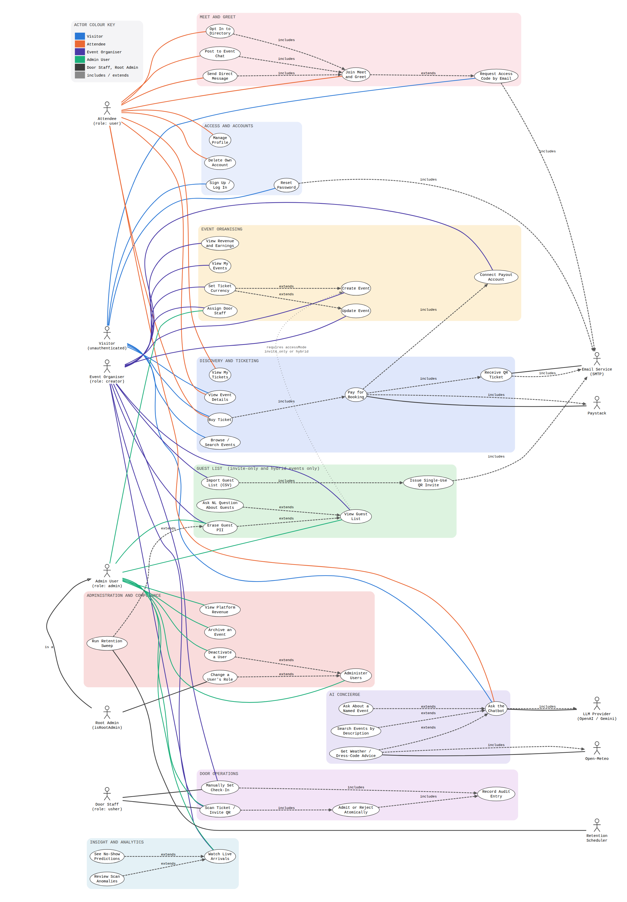
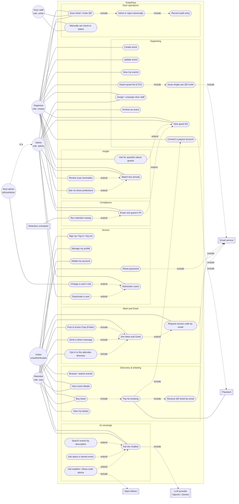

# TicketFlow - Use Case Diagram

> **Diagram set:** [Architecture](architecture-diagram.md) · [Use cases](use-case-diagram.md) · [Data flow](data-flow-diagram.md)

Actors are the four roles in `backend/src/models/userModel.js` (`user`, `creator`, `admin`,
`usher`) - with **root admin** as a specialisation of `admin` - plus unauthenticated visitors
and five external systems. Dashed arrows are `<<include>>` / `<<extend>>` relationships;
solid lines are actor associations.

---

## 1. Use case diagram

*[Full-resolution SVG](diagrams/use-case.svg) · source: [`diagrams/src/use-case.dot`](diagrams/src/use-case.dot) · regenerate with `node docs/diagrams/render.mjs --dot`*

**Reading it.** Stick figures are actors, with **people on the left and external systems on
the right**, so the two never have to be told apart by name. A plain line is an actor
association. A dashed arrow is an `<<include>>` or `<<extend>>` dependency and is always
labelled. The pale bands are subsystems, not deployment units.

**One rule the diagram states rather than implies.** The `GUEST LIST` band is annotated
*invite-only and hybrid events only*. A public event has no guest list at all - everyone
attending it holds a ticket - and `guestService` rejects guest-list management for one with a
400. The dotted `requires accessMode` edge records that this is a precondition on the event,
not a permission on the actor: an organiser who owns a public event still cannot reach these
use cases.

Mermaid source (same content, renders inline on GitHub)

The Graphviz version above is the one to read. This block is kept so the diagram is
diffable as text and viewable in editors that render mermaid but cannot show a linked image -
laid out automatically, it spreads into a single very wide row that is legible on screen but
not on a printed page.

*Rendered: [PNG](diagrams/mermaid/use-case-diagram-1.png) · [SVG](diagrams/mermaid/use-case-diagram-1.svg). Not shown inline - see the note above about its width.*

**Two relationships in this diagram carry a design argument rather than just structure.**

`UC32 Join Meet and Greet` *extends* `UC33 Request access code`, not the reverse: a registered attendee reaches the network directly, and the emailed code is the **alternative** path for the majority of attendees who hold a booking but no account. Modelling it the other way round would imply every participant must pass through an OTP, which is not what the system does.

`UC29 Change a user's role` is associated with **Root admin only**, while `UC30 Deactivate a user` is available to any admin. That asymmetry is the whole point of the root-admin specialisation: administrator status is the one privilege the system refuses to let administrators hand out among themselves.

## 2. Use case ↔ implementation trace

| # | Use case | Actor(s) | Endpoint | Service |
|---|---|---|---|---|
| 1 | Browse / search events | Visitor | `GET /api/events`, `/trending`, `/upcoming`, `/count` | `eventService` |
| 2 | View event details | Visitor, Attendee | `GET /api/events/:slug` | `eventService` |
| 3 | Sign up / log in / log out | Visitor | `POST /users/signup`, `/login`, `GET /logout` | `authService` |
| 4 | Reset password | Visitor | `POST /forgot-password`, `PATCH /reset-password/:token` | `authService` |
| 5 | Buy ticket | Visitor, Attendee | `POST /api/bookings/create` (`isLoggedIn`) | `bookingService` |
| 6 | Pay for booking | Attendee → Paystack | `POST /api/bookings/webhook/paystack` | `paymentService` |
| 7 | Receive QR ticket by email | Attendee | - (side effect of 5, post-commit) | `bookingService` + `email` |
| 8 | View my tickets | Attendee | `GET /api/bookings/my-tickets` | `bookingService` |
| 9 | Manage profile | Attendee | `GET /me`, `PATCH /update-my-details`, `/update-my-password` | `userService`, `authService` |
| 10 | Delete account | Attendee | `DELETE /api/users/delete-me` | `userService` |
| 11 | Create event | Organiser | `POST /api/events/create` | `eventService` + Cloudinary |
| 12 | Update event | Owner, Admin | `PATCH /api/events/update/:eventId` | `eventService` |
| 13 | View my events | Organiser | `GET /api/events/my/events` (returns **all** events for an admin) | `eventService.getMyEvents` |
| 14 | Import guest list | Organiser, Admin | `POST /api/events/:eventId/guests` | `guestService.importGuests` |
| 15 | Issue single-use QR invite | (system, within 14) | - | `guestService` + `generateQrCode` |
| 16 | View guest list | Organiser, Admin | `GET /api/events/:eventId/guests` | `guestService.getGuests` |
| 17 | NL guest query | Organiser, Admin | `POST /:eventId/guests/query` | `nlGuestQueryService` |
| 18 | Watch live arrivals | Organiser, Admin | `GET /:eventId/dashboard`, `GET /:eventId/stream` | `dashboardService` + `admissionBus` |
| 19 | Review scan anomalies | Organiser, Admin | `GET /:eventId/anomalies` | `anomalyReportService` → `anomalyService` |
| 20 | See no-show predictions | Organiser, Admin | - (within the dashboard) | `dashboardService.getNoShowPrediction` → `noShowService` |
| 21 | Assign / unassign door staff | Organiser, Admin | `GET/POST /:eventId/ushers`, `DELETE /:eventId/ushers/:userId` | `usherService` |
| 22 | Erase one guest's PII | Organiser, Admin | `DELETE /:eventId/guests/:guestId/erase` | `retentionService.requestErasure` |
| 23 | Scan QR at the door | Usher, Organiser, Admin | `POST /api/bookings/scan` | `admissionService.checkInByScan` |
| 24 | Admit / reject atomically | (system, within 23) | - | `bookingRepository.admitById` |
| 25 | Manually set check-in status | Usher, Organiser | `PATCH /api/bookings/check-in/:id` | `bookingService.checkInAttendee` |
| 26 | Administer users | Admin | `GET /api/users`, `GET /api/users/:id` | `userService` |
| 27 | Record audit entry | (system, within 24) | - | `auditLogRepository.record` |
| 28 | Run retention sweep | Scheduler | `npm run gdpr:sweep` | `retentionService.sweepExpiredEvents` |
| 29 | Change a user's role | **Root admin** | `PATCH /api/users/:id/role` | `userService.canChangeRole` → `changeUserRole` |
| 30 | Deactivate a user | Admin | `DELETE /api/users/:id` | `userService.canDeleteUser` → `deleteUser` |
| 31 | Archive an event | Admin | `DELETE /api/events/:eventId` | `eventService.deleteEvent` |
| 32 | Join Meet and Greet | Attendee, Guest | `GET /:eventId/network/stream` | `networkingService` |
| 33 | Request access code by email | Guest (no account) | `POST /:eventId/network/guest/request`, `/verify` | `networkingGuestService` + `networkingOtp` |
| 34 | Opt in to the attendee directory | Attendee | `PATCH /:eventId/network/opt-in`, `GET /network/directory` | `networkingService` |
| 35 | Post to Event Chat (Public) | Attendee | `POST /:eventId/network/messages` | `networkingService` |
| 36 | Send a direct message | Attendee | `GET/POST /:eventId/network/dms/:userId` | `networkingService` |
| 37 | Ask the chatbot | Visitor, Attendee | `POST /api/v1/chat` | `chatbotService` → `llmProvider` |
| 38 | Search events by description | Visitor | - (chatbot tool within 37) | `chatbotService` tool `search_events` |
| 39 | Ask about a named event | Visitor | - (chatbot tool within 37) | `chatbotService.resolveEvent` |
| 40 | Get weather / dress-code advice | Visitor, Attendee | - (chatbot tool within 37) | `weatherService` (Open-Meteo) |
| 41 | Work an assigned door | Usher | `GET /api/events/my/assigned-events` | `eventService.getAssignedEvents` |
| 42 | Connect a payout account | Organiser | `GET /users/payout/banks`, `POST /users/payout/resolve-account`, `POST /users/me/payout` | `payoutService` (Paystack subaccounts) |
| 43 | Load an event's organiser workspace | Organiser, Admin, Usher | `GET /api/events/:eventId/workspace` | `eventService.getEventWorkspace` → `admissionService.authorizeScan` |

## 3. Preconditions and business rules worth stating

- **Guest checkout is supported.** Use case 5 sits on `isLoggedIn`, not `protect`, so a
  Visitor can buy without an account - the booking carries a name and email rather than a
  user reference.
- **Invite-only events cannot be purchased into.** `bookingService.createBooking` rejects
  with 403 when `event.accessMode === 'invite_only'`; those events admit only from the
  organiser's guest list. `hybrid` allows both paths.
- **The converse also holds: a public event has no guest list.** Use cases 14–17 and 22 are
  rejected with **400** unless `accessMode` is `invite_only` or `hybrid`, and the UI does not
  offer them at all for a public event - not in My Events, not in the shared organiser tab
  strip, and a hand-typed URL gets an explanation rather than a failing page. This is a
  precondition on the **event**, not a permission on the actor: an organiser who owns a
  public event still cannot reach them. The rule has one definition, `hasGuestList(event)`
  in `eventModel.js`, consumed both by `guestService`'s authorisation check and by use case
  43, which is what the UI reads. It previously existed twice, written in opposite directions
  (`=== 'public'` server-side against `invite_only || hybrid` in the browser), and the two
  disagreed on any event whose `accessMode` was absent.
- **Seats are held before payment, and the ticket is emailed only after it.** Use case 5
  reserves inventory and writes `pending` bookings, then 6 confirms the charge, and only a
  confirmed charge triggers 7. A reservation that is never paid expires and its seats go
  back on sale, so an abandoned checkout costs nothing. Free events skip 6 entirely and are
  confirmed inline.
- **An usher's rights are event-scoped.** Role alone grants nothing: use case 21 writes
  `assignedEvents`, which `admissionService.authorizeScan` checks. An unauthorised scan of
  another event's ticket is still written to the audit log (`reason: wrong_event`).
- **Use cases 25 and 23 are different mechanisms.** 23 is the atomic single-use claim; 25 is
  the fallback for a QR that will not scan, setting `status` to `admitted` or back to
  `issued`. Both are audited, but 25's rows carry `manual: true` and are excluded from
  anomaly detection - a manual entry has no device fingerprint or scan timing, so feeding it
  to the detector would only manufacture flags.
- **Use cases 16–22 share one authorisation rule.** All call `canViewDashboard` (event owner
  or admin), enforced in the service layer so it holds regardless of the route.
- **No actor can promote itself.** Use case 3 filters the submitted role through
  `SIGNUP_ROLES`, so only `user` and `creator` are self-assignable. `usher` is acquired
  implicitly by use case 21, and `admin` only through use case 29 - which is restricted to
  the root admin, cannot be applied to oneself, and cannot demote the root admin. The first
  administrator therefore has no in-application origin at all: it is seeded from the CLI.
- **Use cases 30 and 31 archive rather than destroy.** Both set `isActive: false`; bookings
  (including paid ones), guests, chat history and audit rows survive, because the audit trail
  is precisely the record a door dispute needs. Archiving an event does unassign its door
  staff, since a scan scope on a hidden event is meaningless.
- **Meet and Greet eligibility is a booking, not a role.** Use cases 32–36 require a
  non-revoked, non-rejected booking for that event (or being its organiser/admin); posting
  additionally requires the event to be live. Use case 33 exists because most attendees never
  create an account, and it deliberately returns an identical response whether or not the
  address holds a ticket - otherwise it would be an attendee-enumeration oracle.
- **The chatbot is the only external-LLM path in the system.** Use cases 37–40 call OpenAI
  (Gemini on failure); everything else described as "AI" here - anomaly detection (19),
  NL guest queries (17) and no-show prediction (20) - is local rule or model code with no
  third-party inference. Use case 17 in particular is a **regex intent parser, not an LLM**,
  a distinction worth being precise about in the report.
